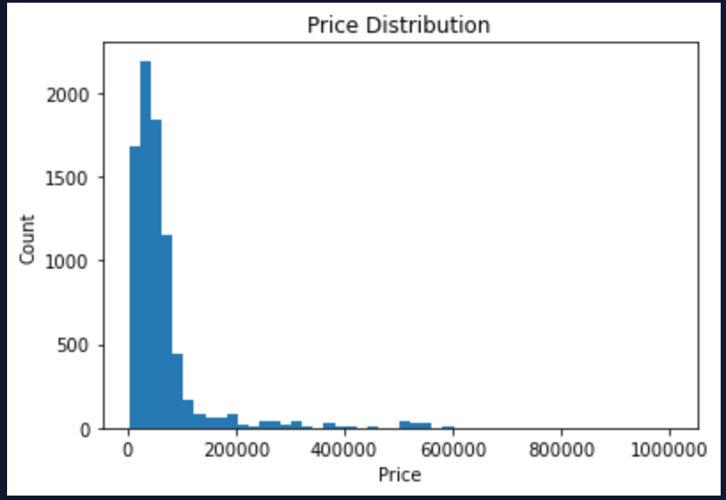
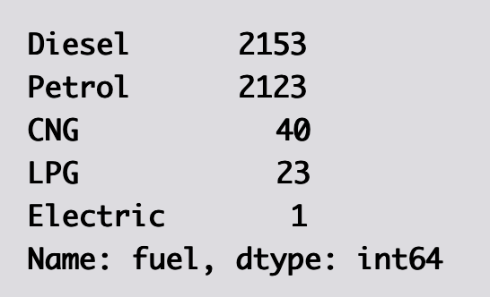
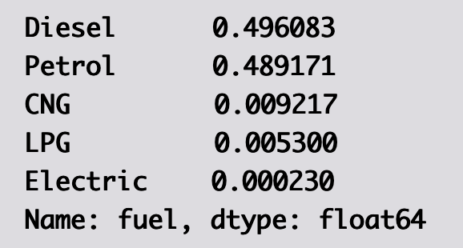

# Exploratory Data Analysis: Summary Statistics

Learn to explore a dataset by choosing a summary statistic.
## Introduction

Summary statistics are an important component of Exploratory Data Analysis (EDA) because they allow a data analyst to condense a large amount of information into a small set of numbers that can be easily interpreted. In order to decide what kind of summary statistic to use, it is important to consider two things:

* The question (and how many variables that question involves)
* The data (is it quantitative or categorical?)

Univariate Statistics

Summary statistics that focus on a single variable are called univariate statistics. They are useful for answering questions about a single feature in tabular data. For example, the following dataset contains information about used cars listed on cardekho.com:

|   |             name             | year | selling_price | km_driven |  fuel  | transmission |     owner    |   mileage  |  engine |
|:-:|:----------------------------:|:----:|:-------------:|:---------:|:------:|:------------:|:------------:|:----------:|:-------:|
| 0 | Maruti Swift Dzire VDI       | 2014 | 450000        | 145500    | Diesel | Manual       | First Owner  | 23.4 kmpl  | 1248 CC |
| 1 | Skoda Rapid 1.5 TDI Ambition | 2014 | 370000        | 120000    | Diesel | Manual       | Second Owner | 21.14 kmpl | 1498 CC |
| 2 | Honda City 2017-2020 EXi     | 2006 | 158000        | 140000    | Petrol | Manual       | Third Owner  | 17.7 kmpl  | 1497 CC |
| 3 | Hyundai i20 Sportz Diesel    | 2010 | 225000        | 127000    | Diesel | Manual       | First Owner  | 23.0 kmpl  | 1396 CC |
| 4 | Maruti Swift VXI BSIII       | 2007 | 130000        | 120000    | Petrol | Manual       | First Owner  | 16.1 kmpl  | 1298 CC |

									

Univariate statistics can help us answer questions like:

* How much does a typical car cost?
* What proportion of cars have a manual transmission?
* How old is the oldest listed car?

Each of these questions focuses on a single variable (`selling_price`, `transmission`, and `year`, respectively, for the above examples). Depending on the type of variable, different summary statistics are appropriate.

## Quantitative Variables

When summarizing quantitative variables, we often want to describe central location and spread. 

### Central Location

The central location (also called central tendency) is often used to communicate the “typical” value of a variable. Recall that there are a few different ways of calculating the central location:

* Mean: Also called the “average”; calculated as the sum of all values divided by the number of values.
* Median: The middle value of the variable when sorted.
* Mode: The most frequent value in the variable.
* Trimmed Mean: The mean excluding x percent of the lowest and highest data points.

Choosing an appropriate summary statistic for central tendency sometimes requires data visualization techniques along with domain knowledge. For example, suppose we want to know the typical price of a car in our dataset. If we calculate each of the statistics described above, we’ll get the following estimates:

* Mean = Rs. 63827.18
* Median = Rs. 45000.00
* Mode = Rs. 30000.00
* Trimmed Mean = Rs. 47333.61

Because the mean is so much larger than the median and trimmed mean, we might guess that there are some outliers in this data with respect to price. We can investigate this by plotting a histogram of `selling_price`:


```py
# Generate a histogram of the selling_price variable
plt.hist(cars['selling_price'])
plt.show()
```



Indeed, we see that `selling_price` is highly right-skewed. The very high prices (10 million Rupees for a small number of cars) are skewing the average upwards. By using the median or a trimmed mean, we can more accurately represent a “typical” price.

### Spread

Spread, or dispersion, describes the variability within a feature. This is important because it provides context for measures of central location. For example, if there is a lot of variability in car prices, we can be less certain that any particular car will be close to 450000.00 Rupees (the median price). Like the central location measures, there are a few values that can describe the spread:

* Range: The difference between the maximum and minimum values in a variable.
* Inter-Quartile Range (IQR): The difference between the 75th and 25th percentile values.
* Variance: The average of the squared distance from each data point to the mean.
* Standard Deviation (SD): The square root of the variance.
* Mean Absolute Deviation (MAD): The mean absolute value of the distance between each data point and the mean.

Choosing the most appropriate measure of spread is much like choosing a measure of central tendency, in that we need to consider the data holistically. For example, below are measures of spread calculated for `selling_price`:

* Range: Rs. 9970001
* IQR: Rs. 420001
* Variance: 650044550668.61 (Rs^2)
* Standard Deviation: Rs. 806253.40
* Mean Absolute Deviation: Rs. 42,213.14

We see that the range is almost 10 million Rupees; however, this could be due to a single 10 million Rupee car in the dataset. If we remove that one car, the range might be much smaller. The IQR is useful in comparison because it trims away outliers.

Meanwhile, we see that variance is extremely large. This happens because variance is calculated using squared differences, and is therefore not in the same units as the original data, making it less interpretable. Both the standard deviation and MAD solve this issue, but MAD is even less impacted by extreme outliers.

For highly skewed data or data with extreme outliers, we therefore might prefer to use IQR or MAD. For data that is more normally distributed, the variance and standard deviation are frequently reported.

## Categorical Variables

Categorical variables can be either ordinal (ordered) or nominal (unordered). For ordinal categorical variables, we may still want to summarize central location and spread. However, because ordinal categories are not necessarily evenly spaced (like numbers), we should NOT calculate the mean of an ordinal categorical variable (or anything that relies on the mean, like variance, standard deviation, and MAD).

For nominal categorical variables (and ordinal categorical variables), another common numerical summary statistic is the frequency or proportion of observations in each category. This is often reported using a frequency table and can be visualized using a bar plot.

For example, suppose we want to know what kind of fuel listed cars tend to use. We could calculate the frequency of each fuel type:

```py
cars.fuel.value_counts()
```



This tells us that `'Diesel'` cars are most common, with `'Petrol'` cars a close second. Converting these frequencies to proportions can also help us compare fuel types more easily. For example, the following table of proportions indicates that `'Diesel'` cars account for almost half of all listings.

```py
cars.fuel.value_counts(normalize=True)
```



## Bivariate Statistics

In contrast to univariate statistics, bivariate statistics are used to summarize the relationship between two variables. They are useful for answering questions like:

* Do manual transmission cars tend to cost more or less than automatic transmission?
* Do older cars tend to cost less money?
* Are automatic transmission cars more likely to be sold by individuals or dealers?

Depending on the types of variables we want to summarize a relationship between, we should choose different summary statistics.


## One Quantitative Variable and One Categorical Variable

If we want to know whether manual transmission cars tend to cost more or less than automatic transmission cars, we are interested in the relationship between `transmission` (categorical) and `selling_price` (quantitative). To answer this question, we can use a mean or median difference.

For example, we could calculate that the median price of automatic transmission cars is 100000 Rupees higher than for manual transmission cars.

### Two Quantitative Variables

If we want to know whether older cars tend to cost less money, we are interested in the relationship between `year` and `selling_price`, both of which are quantitative. To answer this question, we can use the Pearson correlation.

For example, if we calculate that the correlation between `year` and `selling_price` is 0.4, we can conclude that there is a moderate positive association between these variables (older cars do tend to cost less money).

## Two Categorical Variables

If we want to know whether automatic transmission cars are more likely to be sold by individuals or dealers, we are interested in the relationship between `transmission` and `seller_type`, both of which are categorical. We can explore this relationship using a contingency table and the Chi-Square statistic.

For example, based on the following contingency table, we might conclude that a higher proportion of cars sold by dealers are automatic (compared to cars sold by individuals):


# Conclusion

In this article, we’ve summarized some of the important considerations for choosing a summary statistic based on the question a data analyst wants to answer and the type of data that is available. When it comes to choosing summary statistics, there’s no one right answer, but exploring data holistically and systematically is an important component of EDA.