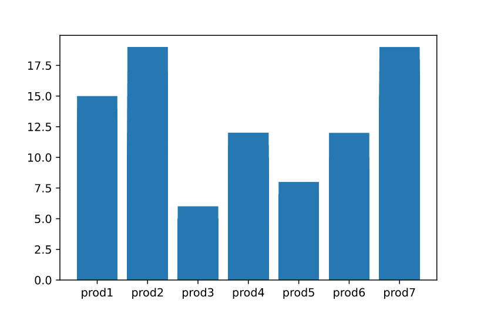
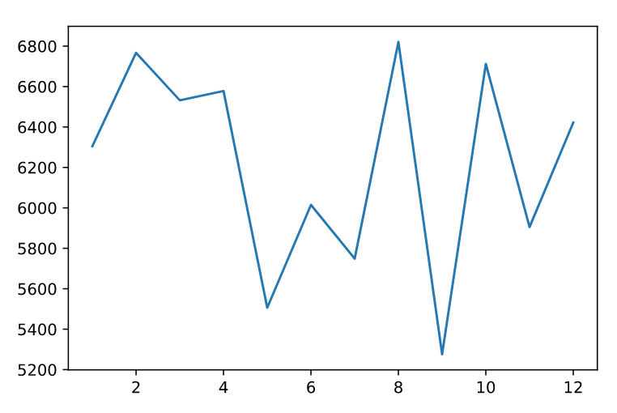
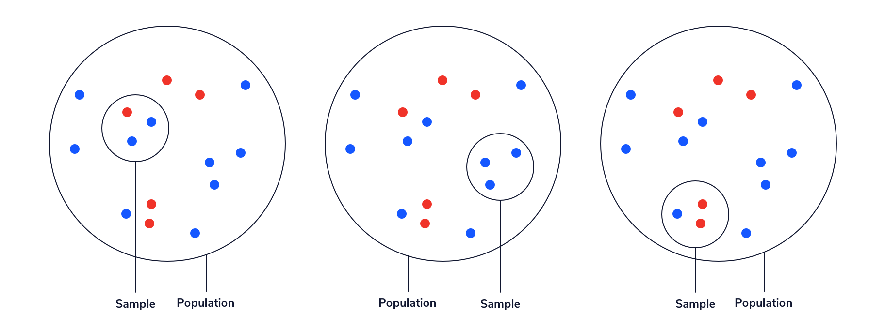

# Descriptive vs. Inferential Statistics

Descriptive and inferential statistics are two subfields of the larger field of statistics. Each is used for distinct purposes. In this article, we will introduce and explore some of the methods associated with each one.

## Descriptive Statistics
Descriptive statistics is all about summarizing data. It is useful for making large amounts of information into an interpretable subset of numbers and/or visualizations. Imagine a long and complex spreadsheet; we would not be able to easily understand the data (any trends, patterns, or meaningful summaries) just by looking over the rows and columns. However, with descriptive statistics, we are able to distill that information into numbers and visualizations that we can make sense of.

Commonly used descriptive statistics include the average, median, frequency, standard deviation, and range of a set of values. These numeric descriptive statistics can also be displayed as visual representations, such as tables and graphs.
Example: Sales Company

Suppose you work at a large company and you have been given a dataset of sales information from the past month. You could use descriptive statistics to turn the dataset into a one-page report or table that will be more readable and provide more information than the raw data. Some potential descriptive statistics in the report could include:

    Average # sales per day: 214.0667 	
    Total Sales of Each Product This Month:

    % Salespeople that met quota: 60%
    Monthly Sales Throughout the Year:

This is a picture of a graph where the height of the line corresponds to the total number of product sales of a given month.

The data is easily interpretable in this form. Instead of trying to make sense of a spreadsheet of the raw data, we can learn specific pieces of information very easily. In this example, we can see that Product 3 is sold the least while Product 7 is sold the most. We can also see how sales varied throughout the year.

## Inferential Statistics

Inferential statistics is all about using a sample (a subset of a population) to make inferences about a larger population of interest. This is useful when we want to know something about a population but cannot observe every member — often due to time, feasibility, or monetary constraints. Some methods that are used in inferential statistics include hypothesis testing and regression.

The key to inferential statistics is understanding that samples do not always accurately reflect the population they came from. A large part of inferential statistics is quantifying our uncertainty about a population by looking at a smaller sample.

For example, the population shown below is made up of 10 blue dots and 5 red dots, which means that two thirds of the population is blue and one third is red. Suppose we take a random sample of 3 dots and want to use that sample to estimate proportion of the population that is blue. If we’re lucky, we’ll sample 2 blue dots and 1 red dot, as shown on the left, which would accurately represent the proportions of blue to red dots in the population. However, we could also randomly sample 3 blue dots, or 2 red dots and 1 blue dot — both of which do not match the population. Inferential statistics allows us to look at a sample and then quantify our uncertainty about how similar (or different) the entire population might be.

## Example: Customer Contacting

Suppose you work at a sales company that is interested in testing two different customer contacting methods to see if one leads to a higher response rate than the other. It is impossible to test both methods with the entire population of every single past, present, and future customer. Instead, you could take a sample of 1,000 customers and randomly assign them to either a text contacting system or a phone calling system. After one month, you could then calculate the difference in response rate (a descriptive statistic) for the two sampled groups.

Suppose you find that the customers who received a text were 12% more likely to respond than the customers who received a phone call. This is a descriptive statistic about the sample — but what you really want to know is: if you had sampled the full population of customers, would you still have found at least a 12% difference in response rate?

This is where inferential statistics methods come in handy! For example, you could use a hypothesis test to estimate the probability that, in the full population, you will observe a higher response rate for texts compared to calls given that you observed a higher rate in your sample.

## Example: Test Scores

Suppose you are a researcher studying the relationship between high school students’ homework grades and standardized test scores. It would be very difficult and expensive to collect information on homework grades and standardized test scores for every single high school student in the world. Instead, you could find a random sample of students and inspect the relationship between homework grades and standardized test scores among that sample. Finally, you could use a regression analysis (another inferential statistics method) to understand whether a similar relationship is likely to exist in the larger population of all students.

