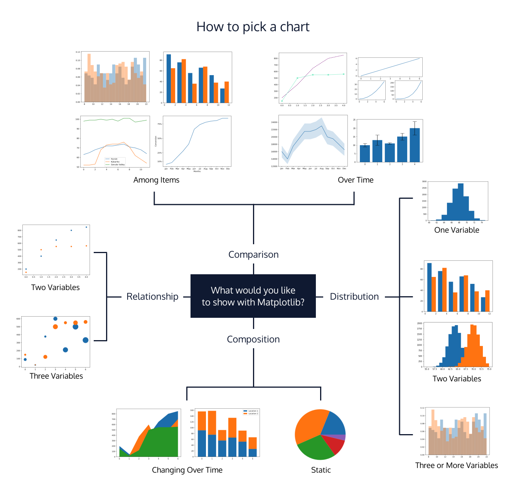

# How to Select a Meaningful Visualization
## Brainstorming your visualization

The three steps in the data visualization process are preparing, visualizing, and styling data. When faced with a blank canvas, the second step of the process, visualizing the data, can be overwhelming. To help, we’ve created a diagram to guide the selection of a chart based on what you want to explore in your data.

When planning out a visualization, you’ll usually have an idea of what questions you’ll want to explore. However, you may initially wonder exactly which chart to use. This moment is one of the most exciting parts of the process!

During your brainstorming phase, you should consider two things:

* The focusing question you want to answer with your chart
* The type of data that you want to visualize

Depending on the focusing questions you’re trying to answer, the type of chart you select should be different and intentional in its difference. In the diagram below, we have assigned Matplotlib visualizations to different categories. These categories explore common focusing questions and types of data you may want to display in a visualization.

## Chart categories
### Composition charts

Focusing Question: What are the parts of some whole? What is the data made of?

Datasets that work well: Data pertaining to probabilities, proportions, and percentages can be visualized as with the graphs in this composition category. Charts in this category illustrate the different data components and their percentages as part of a whole.

### Distribution Charts

Datasets that work well: Data in large quantities and/or with an array of attributes works well for these types of charts. Visualizations in this category will allow you to see patterns, re-occurrences, and a clustering of data points.

Note: In statistics, a commonly seen distribution is a bell curve, also known as a normal distribution. A bell curve is a bell-shaped distribution where most of the values in the dataset crowd around the average (also known as the mean), therefore causing the curve to form. If you want to see how values in the data are “distributed” across variables, the best way to do that would be with the visualizations in this category.

### Relationship Charts

Focusing Question: How do variables relate to each other?

Datasets that work well: Data with two or more variables can be displayed in these charts. These charts typically illustrate a correlation between two or more variables. You can communicate this relationship by mapping multiple variables in the same chart. Correlation measures the strength of a relationship between variables.

### Comparison Charts

Focusing Question: How do variables compare to each other?

Datasets that work well: Data must have multiple variables, and the visualizations in this category allow readers to compare those items against the others. For example, a line graph that has multiple lines, each belonging to a different variable. Multi-colored bar charts are also a great way to compare items in data.

# Summary

When brainstorming a visualization, use the diagram above to guide the selection of your chart. Remember to be intentional in your selection by thinking about what type of data you’re dealing with and what focusing question you wish to answer.
