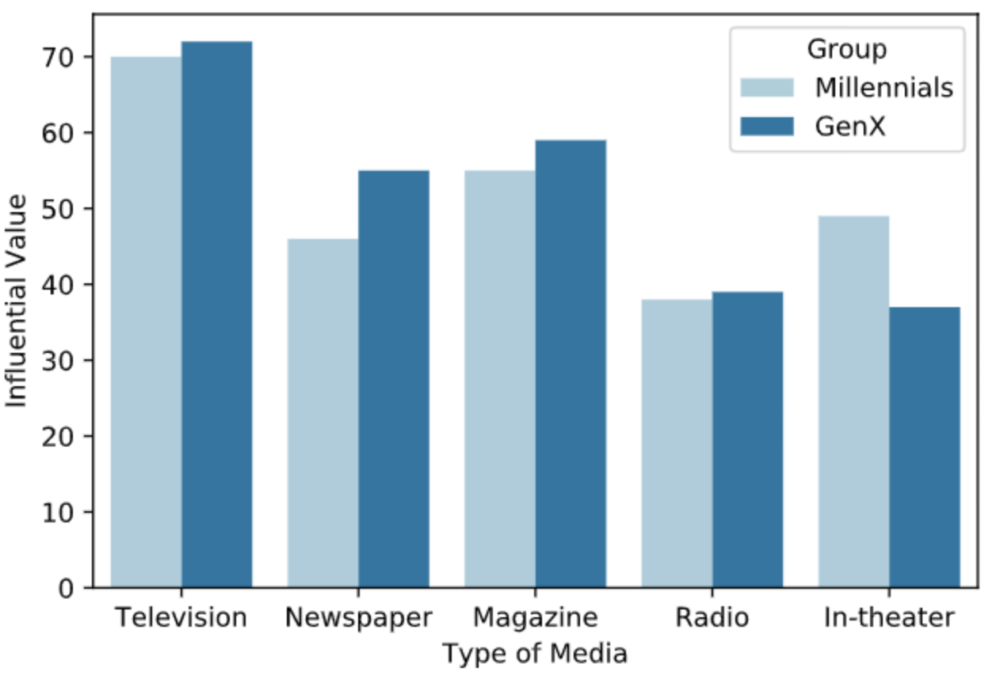
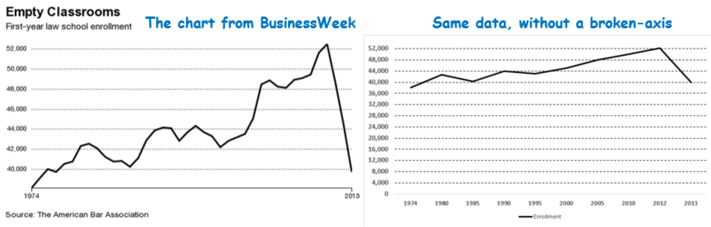
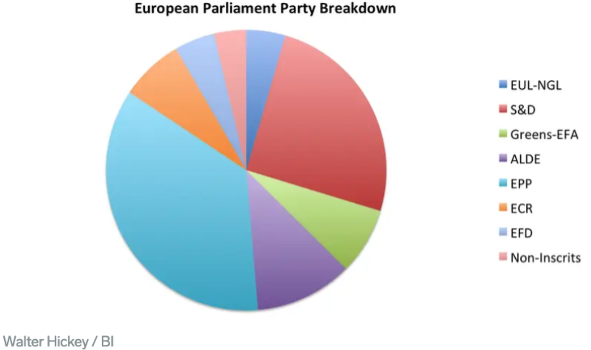
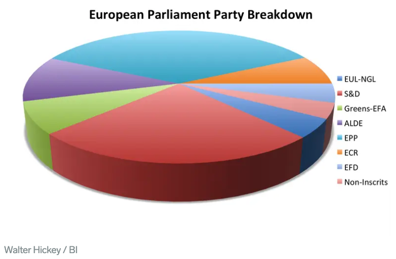
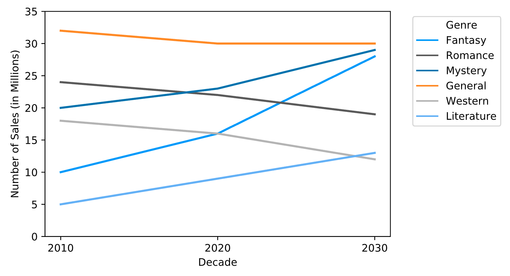
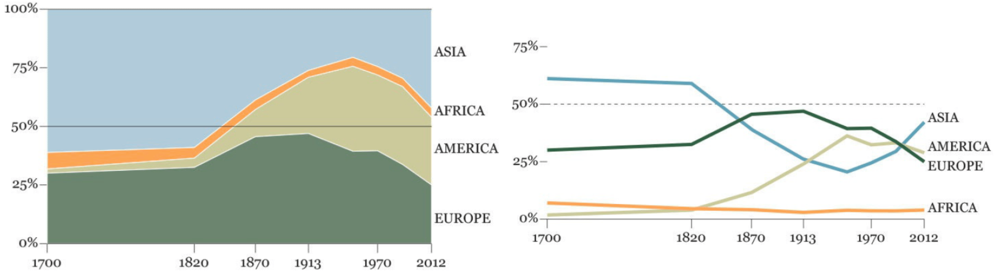
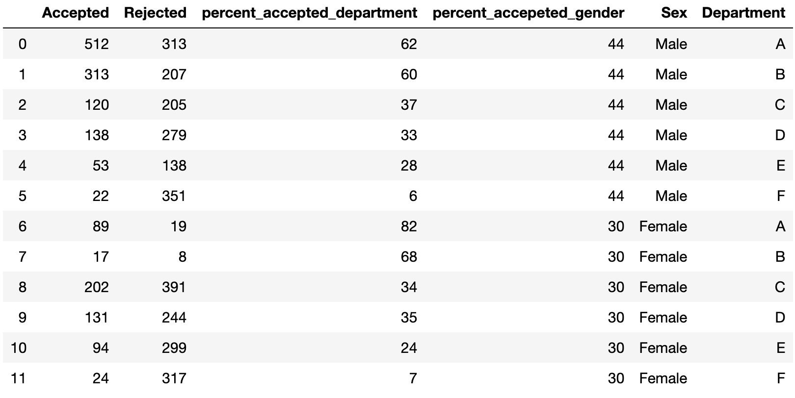

# Data Visualization Best Practices

A brief overview of what to consider when making data visualizations.
# Introduction

As a data scientist, an essential part of your role is to effectively present and communicate your findings to both your peers and key stakeholders. While some stakeholders may be well versed in the latest machine learning techniques, most fall outside the realm of data science. This is why clear data visualization is essential to effectively tell the story of your data.

It is important to keep your research question in mind when creating visuals. As a whole, your analysis should tell the full story of the data, and the visuals should help that process. Similar to childhood stories, images can tell the reader an enormous amount of information in a small amount of space. Likewise, the visuals you create should tell the reader the information the data conveys.

# What to consider
In general, your visuals should include clearly labeled axes that are evenly spaced. Legends and colors should be used when plotting data across multiple groups. Let’s take a dive into this.

# Color

When choosing colors, it is best to avoid complementary colors, such as red and green. These types of combinations leave no discernable difference between the shades for readers who are color blind. There are built-in color palettes in visualization libraries in Python that can make choosing what color scheme to use a little bit easier. [Here](http://seaborn.pydata.org/tutorial/color_palettes.html) are some varieties for color palettes in the seaborn library.

## Bar charts

We can use bar charts to help the reader better understand and visualize relative differences across groups (ie. when the x-axis is made up of categorical data). In the example below, we will look at hypothetical data about the influential value of different media types between millennials and Gen Xers.

We see that television has the highest influential value for both millennials and Gen Xers, in-theater media is more impactful towards millennials as compared to Gen Xers, and print media is preferred by Gen Xers, as compared to millennials. 

If we wanted to use bar charts to look at averages across groups, we could add error bars that include both the upper and lower limits. However, averages across groups might be better communicated using a scatter plot with error bars because bar charts display aggregated information rather than one number.

## Line Charts
Line charts are helpful when the x-axis reflects a quantitative variable, such as time. They emphasize the rate of change. Some examples of line charts are crimes that occur throughout the day, changes in the value of the dollar across years, and candy sales throughout the year.

## Y-axis

It is always important to remember what the data demonstrates and translate that into your visualization. When working with bar charts and line charts, we should consider whether we include or exclude zero on the y-axis.

The example below shows two charts of data that look at first-year law school enrollment from 1974 to 2013 (source: [Abhinav Agarwal](https://twitter.com/AbhinavWork/status/543465266928041984)). The plot on the left shows that over 30 years gains in first-year law school enrollment was eliminated within a year. The plot on the right shows the same data scaled differently to include 0 on the y-axis. While you can see the drop in law school enrollment and changes in enrollment throughout the years, the information is not as apparent or striking. This is why context matters, and the data should be the guiding force in your visualization process. 

# What to avoid

While visuals can be helpful in translating your data, not all visuals are informative. Poor designs can confuse or misinform the reader, rather than guide the reader through your data story. Some common types of charts to avoid are:

    Pie charts
    Stacked bar charts
    Stacked area charts

## Pie charts
Pie charts run into a few common errors, such as using too many categories, lacking order, or for each piece of the pie to not add up to 100%. Readers are forced to compare areas or angles rather than relative magnitudes as you would with bar charts. In the example below from a [Business Insider](https://www.businessinsider.com/pie-charts-are-the-worst-2013-6) article about pie charts, we cannot confidently arrange the pieces of the pie based on magnitude. We can see the largest European Parliament party is EPP, but can we distinguish the smallest party? 

It is made worse when it’s made into a 3-dimensional pie chart. When pie charts are made 3-dimensional, it distorts how much area a category, or in this case, European Parliament Party, takes up. This would mislead the reader into thinking the data is telling us something that it is not. 

## Stacked bar charts

While stacked bar charts try to combine information from a variety of groups into one chart, they make it difficult to compare categories across groups. This image from [Google documentation](https://developers.google.com/chart/interactive/docs/gallery/barchart#stacked-bar-charts) about charts contains information about hypothetical book sales across genres across three decades (2010s, 2020s, and 2030s). It is difficult to identify the distinct differences in sales across genres that are not Fantasy & Sci-Fi. 

Taking the same data, we might instead consider to look at the changes in book sales for each decade by genre. In the line chart below, we see growth in book sales every decade for Fantasy & Sci Fi, Mystery, and Literature genres and decreases in sales every decade for Romance and Western genres. While there was decrease in sales from 2010 to 2020 for the General genre, it still out performs every genre in terms of book sales. 

## Stacked area charts

Similar to stacked bar charts, stacked area charts can also be confusing to interpret. In this example (Cairo, 2016) (source: Truthful Art, The: Data, Charts, and Maps for Communication), the stacked area chart on the left shows contributions to the worldwide GDP from Asia, Africa, America, and Europe over time. We see that Asia in 1700 contributed more than 50% to the worldwide GDP, compared to Europe who contributed a little over 25%. However, in 2012, we cannot clearly see if Europe’s contribution to the worldwide GDP is greater or less than the Americas. The stacked area chart does not clearly communicate gains in GDP in Asia nor the relative stagnancy in worldwide GDP shares in Africa. In the chart on the right instead, we can see the relative GDP sizes for all regions and how they have changed over time.

# Visualization in Python

There are two main plotting libraries that most Python users use: Matplotlib and seaborn. Both libraries can create beautiful visuals–Matplotlib is versatile and customizable, whereas seaborn is built on top of Matplotlib and its features are a little more user friendly. Let’s go through an example using both of these libraries!

In 1973, the University of California Berkeley was sued for gender discrimination amongst its graduate admissions. We will explore the arguments of the plaintiff and the defendant with the data below and create some visuals using Matplotlib and seaborn. The plaintiff argued that UC Berkeley discriminated against women in their graduate admissions because men were accepted at a rate of 44% compared to 30% for women. However, when we look at data and focus on the acceptance rate across departments, that is no longer the case. We see that in four out of the six departments women have a higher acceptance rate than men. Note: the specific departments are not known, so we will go with generic A-F as our labels.

We can see this better visually using bar charts. The following code will walk you through how to create the same plot in both Matplotlib and in seaborn. 

