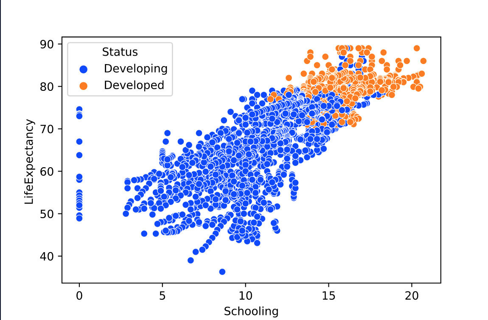

# Visualizing Multivariate Relationships


# Introduction
Exploring multivariate relationships is an important skill to have as a data analyst or scientist. You might be familiar with univariate (one variable) and bivariate (two variables) analysis. However, datasets often contain more than two features, so it’s important to be able to explore and visualize multiple variables at a time.

In this article, you will learn how to visualize multivariate relationships using:

* Scatter plots with visual cues
* Grouped box plots
* Multi-dimensional plots

## Scatter plots with visual cues
One way to represent multivariate relationships is to use visual cues such as colors, shapes, and sizes in a scatter plot. Let’s demonstrate an example using life expectancy [data](https://www.kaggle.com/kumarajarshi/life-expectancy-who) from the World Health Organization.

First, let’s load in the data:
```py
# import libraries
import pandas as pd
import seaborn as sns
import matplotlib.pyplot as plt 

# load in health data
health_data = pd.read_csv('life_expectancy_data.csv')
```

Next, let’s create a scatter plot using Python’s `seaborn` library to visualize the relationship between years of education and life expectancy:

```py
# create scatter plot
sns.scatterplot(x = 'Schooling', y = 'LifeExpectancy', data = health_data)
plt.show()
```


It is clear from this chart that there is a positive relationship between years of schooling and life expectancy.

Let’s make this analysis more interesting by adding a third variable to the scatter plot using color as a visual cue. We can do this by passing in a hue argument:
```py
# scatter plot with a visual cue
sns.scatterplot(x = 'Schooling', y = 'LifeExpectancy', hue = 'Status', palette = 'bright', data = health_data)
plt.show()
```



This multivariate visualization provides much more insight than the bivariate visualization above. For example, we can see that:

* Years of education and life expectancy have a positive relationship
* Individuals in developed countries have more years of schooling than individuals in developing countries
* The life expectancy in developed countries is greater than the life expectancy in developing countries

Even though it’s possible to add more variables using additional visual cues, it’s not always a great idea to do so. For example, let’s try adding a fourth variable to this visualization using shapes as a visual cue: 

```py
# scatter plot with four variables
sns.scatterplot(x = 'Schooling', y = 'LifeExpectancy', hue = 'Status', style = 'Year', data = health_data)
plt.show()
```


This chart is overloaded with information and is difficult to read. You always want to make sure your charts are readable and easy to interpret. Generally, anything beyond three variables in a scatter plot is probably too much for the human eye to process.

## Grouped box plots
Grouped box plots can be used to visualize two categorical variables and a quantitative variable. Having the box plots side-by-side can help you gain useful insights.

For example, let’s take a look at Stack Overflow’s Developer Survey [data](https://insights.stackoverflow.com/survey) to learn more about how salary is related to education level and gender.

First, let’s load in the data: 

```py
# load in salary data
salary_data = pd.read_csv('survey_data.csv')

```

Next, let’s create a box plot to show the relationship between education and compensation:
```py
# box plot showing relationship between education and compenstation
sns.boxplot(x = "Education", y = "CompTotal", palette = "pastel", data = salary_data)
plt.show()
```


This chart gives us the relationship between education and compensation, but let’s take it a step further to see whether men and women are paid equally. We can use the argument hue to group by gender:

```py
# side-by-side box plots grouped by gender
sns.boxplot(x = "Education", y = "CompTotal", hue = "Gender", palette = "pastel", data = salary_data)
plt.show()
```


This grouped box plot allows us to compare salaries for men and women with the same level of education.

We can see that among adults in the Less than `bachelor's`, `Bachelor's Education`, and `Master's groups`, men tend to earn a higher median salary than women with the same level of education; however, this pattern is reversed for men and women with `Professional` degrees.

## Multi-dimensional plots
Another way to represent multivariate relationships is to use multi-dimensional plots. For example, if we want to represent three variables in a dataset we can create a 3D scatter plot.

We will use the Python graphing library `Plotly` to load in a dataset and create an interactive 3D plot.

Let’s load in the iris dataset and visualize the relationship between `sepal_length`, `sepal_width`, and `petal_width` for three different iris species:

```py
# import library
import plotly.express as px

# load in iris data
df = px.data.iris()

# create 3D scatter plot
fig = px.scatter_3d(df, x='sepal_length', y='sepal_width', z='petal_width', color='species')
fig.show()
```

This code outputs a 3D scatter plot that looks like this:


Notice how there are now three axes instead of two, allowing you to see your data in a new dimension.

3D plots allow you to see relationships that might not be visible in 2D, such as clusters. Interactive graphing libraries such as `Plotly` allow you to rotate the plot to see points from different angles and zoom into specific areas of interest.

The downside of 3D plots is that they can be difficult to read in two dimensions. That means that if you need to write a paper report, a 3D plot might not be the best idea.

## Review
Datasets often contain many features, which we can use in a model to make predictions or run an analysis. Therefore, it’s important to be able to understand and visualize multiple relationships at once.

In this article, you learned how to represent multivariate data using:

* Scatter plots with visual cues
* Grouped box plots
* Multi-dimensional plots

You are now better equipped to create more meaningful visualizations and to think beyond just simple univariate and bivariate terms. 