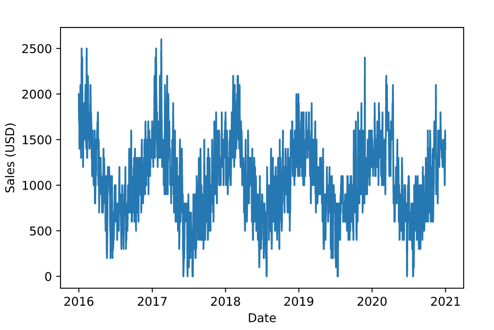
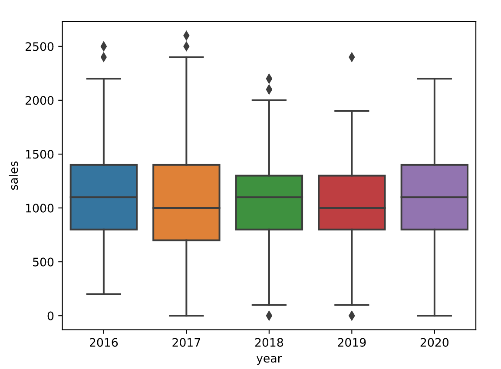
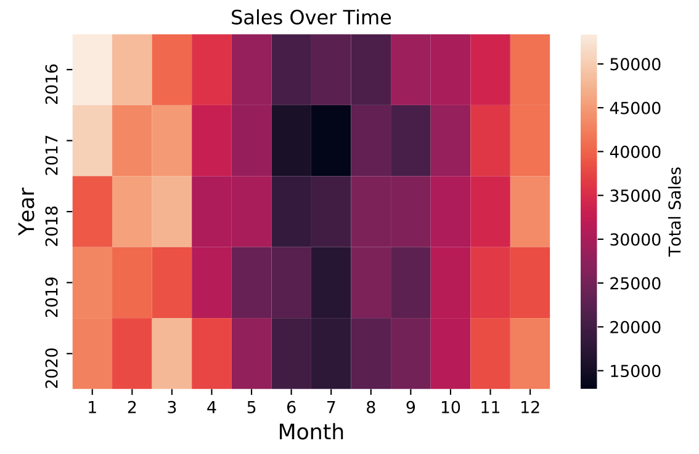
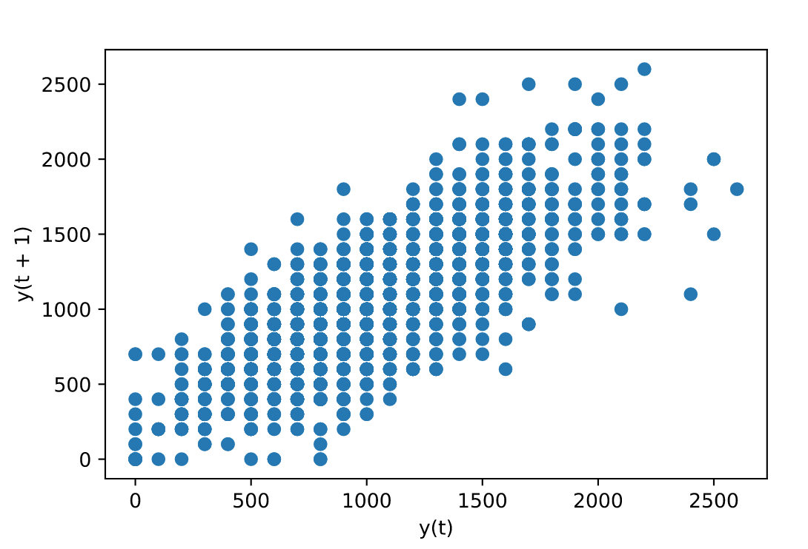
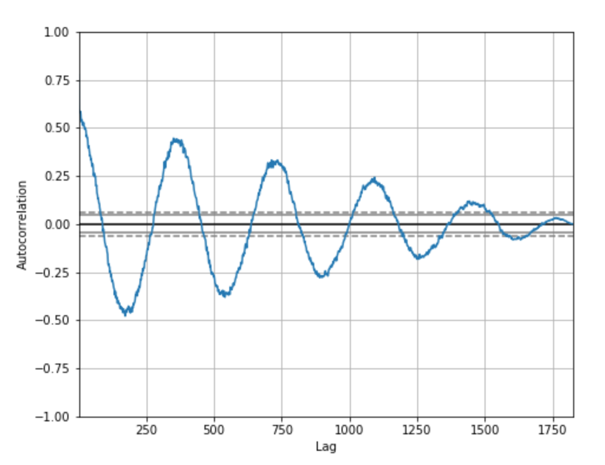

# Visualizing Time Series Data With Python
Introduction

Data represented in a single point in time is known as cross-sectional data. As a Data Scientist or Analyst, sometimes you might encounter data that is collected over periods of time, known as time series data.

Time series data shows up in the real world quite often. For example, weather readings, company stock prices, and sales data are all examples of data that can be tracked over time. Therefore, it’s important that you are able to explore and visualize data with a time component.

In this article, you will learn how to explore time series data with Python using the following:

* Line plots
* Box plots
* Heatmaps
* Lag plots
* Autocorrelation plots


# Line plot

A line plot is commonly used for visualizing time series data.

In a line plot, time is usually on the x-axis and the observation values are on the y-axis. Let’s show an example of this plot using a CSV file of sales data for a small business over a five-year period.

First, let’s import several useful Python libraries and load in our data:


```py
# import libraries
import pandas as pd 
import matplotlib.pyplot as plt
import seaborn as sns

# load in data
sales_data = pd.read_csv("sales_data.csv")

# peek at first few rows of data
sales_data.head()
```

Here are the first few rows of the sales data:
| date | sales

— | — | — 0 | 2016-01-01 | 2000.0 1 | 2016-01-02 | 1700.0 2 | 2016-01-03 | 1800.0 3 | 2016-01-04 | 1400.0 4 | 2016-01-05 | 1500.0

Let’s create a line plot of the data, with date on the x-axis and sales on the y-axis:

```py
# convert string to datetime64
sales_data["date"] = sales_data["date"].apply(pd.to_datetime)
sales_data.set_index("date", inplace=True)

# create line plot of sales data
plt.plot(sales_data["date"], sales_data["sales"])
plt.xlabel("Date")
plt.ylabel("Sales (USD)")
plt.show()
```



Notice how we can see the trend of the data over time. Looking at the chart, it seems that:

* Sales are seasonal, peaking at the beginning and end of each year, and slowing down in the middle of each year.
* Sales don’t seem to show signs of growth over time. This appears to be a stagnant business.

# Box plot

When working with time series data, box plots can be useful to see the distribution of values grouped by time interval.

For example, let’s create a box plot for each year of sales and put them side-to-side for comparison:

```py
# extract year from date column
sales_data["year"] = sales_data["date"].dt.year

# box plot grouped by year
sns.boxplot(data=sales_data, x="year", y="sales")
plt.show()
```



For each year of the sales data, we can easily see useful information such as median sales, the highest and lowest sales, the interquartile range of our data, and any outliers.

Median sales for each year (represented by the horizontal line in each box) are quite stable, suggesting that sales are not growing over time.

# Heatmap
We can also use a heatmap to compare observations between time intervals in time series data.

For example, let’s create a density heatmap with year on the y-axis and month on the x-axis. This can be done by invoking the heatmap() function of the sns Seaborn object:

```py
# calculate total sales for each month
sales = sales_data.groupby(["year", "month"]).sum()

# re-format the data for the heat-map
sales_month_year = sales.reset_index().pivot(index="year", columns="month", values="sales")

# create heatmap
sns.heatmap(sales_month_year, cbar_kws={"label": "Total Sales"})
plt.title("Sales Over Time")
plt.xlabel("Month")
plt.ylabel("Year")
plt.show()
```



Recall that in a heatmap, as the color gets brighter and moves from dark purple to yellow, the total sales in the corresponding cell is higher.

Here, we see once again that the sales are pretty consistent year after year and also exhibit seasonality.

# Lag scatter plot
We can use a lag scatter plot to explore the relationship between an observation and a lag of that observation.

In a time series, a lag is a previous observation:

* The observation at a previous time step (the smallest time interval for which we have distinct measurements) is called lag 1.
* The observation at two times ago is called lag 2, etc.

In the sales dataset, we have a different sales value for each day. Therefore, the lag 1 value for any particular day is equal to the sales on the previous day. The lag 2 value is the sales two days ago, etc.

The `plotting` module of the [pandas](https://codecademy.com/resources/docs/pandas) library has a built-in `lag_plot` function that plots the observation at time t on the x-axis and the lag 1 observation (t+1) on the y-axis:

```py
# import lag_plot function
from pandas.plotting import lag_plot

# lag scatter plot
lag_plot(sales_data)
plt.show()
```



How can we interpret a lag scatter plot?

* If the points move from the bottom left to the top right, this indicates a positive correlation between observations and their lag 1 values. For example, high sales on one day are associated with high sales on the previous day.
* If the points move from the top left to the bottom right, this indicates a negative correlation between observations and their lag 1 values. For example, high sales on one day are associated with low sales on the previous day and vice versa.
* If there is no identifiable structure in the lag plot, this indicates the data is random, and there is no association between values at consecutive time points. For example, sales on one day tell you no information about expected sales on the following day.

Exploring the relationship between an observation and a lag of that observation is useful for helping us determine whether a dataset is random.

Since the points in the sales data move along a diagonal line from the bottom left to the top right, this indicates that our data is not random and there is a positive correlation between observations and their lag 1 values.

# Autocorrelation plot
An _autocorrelation_ plot is used to show whether the elements of a time series are positively correlated, negatively correlated, or independent of each other.

This can be plotted with the `autocorrelation_plot()` function of the pandas.plotting module:

```py
# import autocorrelation function
from pandas.plotting import autocorrelation_plot

# autocorrelation plot
autocorrelation_plot(sales_data)
plt.show()
```


In the autocorrelation plot above, lag is on the x-axis and the value of the autocorrelation, which ranges from -1 to 1, is on the y-axis. A value near 0 indicates a weak correlation while values closer to -1 and 1 indicate a strong correlation.

Notice how the autocorrelation plot for the sales data forms waves, oscillating between strong negative and positive correlation. These waves suggest that our dataset exhibits seasonality.

Also, notice how the autocorrelation decreases over time. This indicates that sales tend to be similar on consecutive days, but sales from three years ago are less associated with today’s sales than sales from one year ago.

# In this article, you got a brief introduction to exploring and visualizing time series data using:

* Line plots
* Box plots
* Heatmaps
* Lag plots
* Autocorrelation plots

As a Data Scientist or Analyst, you will often work with data that changes over time. Moving forward, you are now better equipped to explore and visualize data with a time component. 