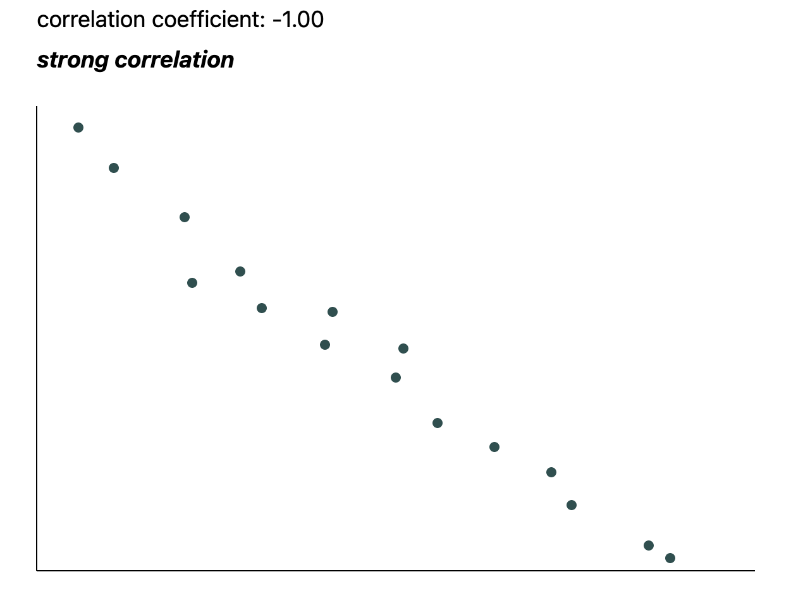
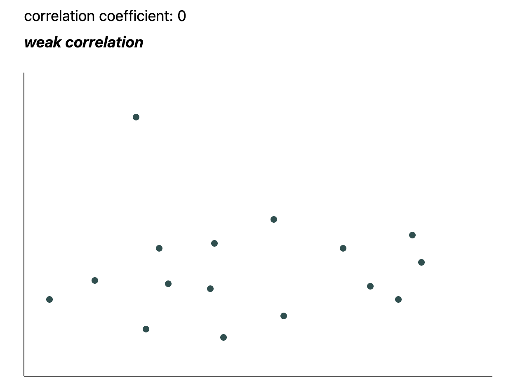
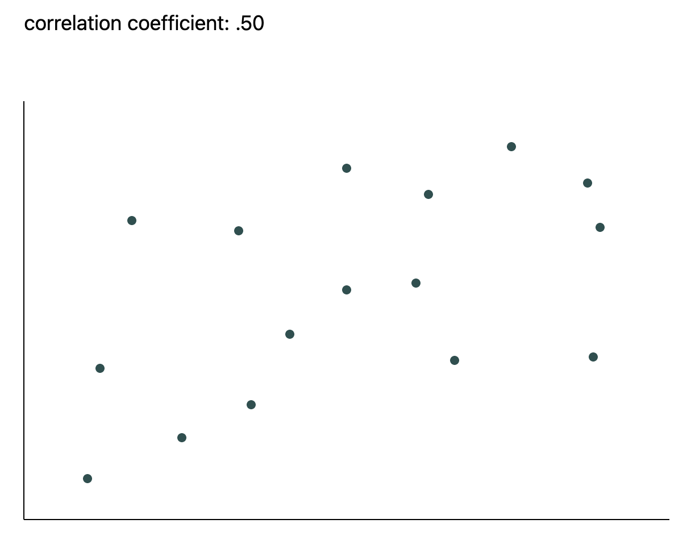

# Handling Missing Data with Deletion

How to remove data the safe way

We now know why missing data is important, and understand the differences between different types of missing data. Now, we are ready to tackle some missing data. One method we can use to combat missing data is deletion.

Deletion is, quite simply, when we remove some aspect of our missing data so that our resulting dataset is as complete as possible, leading to accurate analytics. Since missing data does not provide a complete picture of what happened in our observations, we can’t rely on it for analytics, hence why deleting data can be a good solution.

## When is it safe to use deletion?

    Is it really safe to delete data?

Deleting data sounds like it could cause more problems than having missing data in the first place. And in some situations, that might be the case! There are some scenarios where deleting data is safe, and others where it is not advised.

The big risk with deletion is that we could introduce bias, or unrepresentative data, into the dataset. If we delete too much data, or the wrong kind of data, then the resulting dataset no longer describes what actually happened accurately. In general, data is safe to delete when:


1. It is either MAR or MCAR missing data. We can remove data that falls into either of these categories without affecting the rest of the data, since we assume that the data is missing at random. However, if the percentage of missing data is too high, then we can’t delete the data — we would be reducing our sample size too much.

    Note that every dataset or analytics use case will have a different definition of how much missing data is “too much”. For example, data used to predict credit card fraud would have a smaller tolerance for missing data than health survey data.
2. The missing data has a low correlation with other features in the data. If the missing data is not important for what we’re doing, then we can safely remove that data.

Correlation at -1.0:



Weak correlation at 0:


No correlation at 0.5:



# Types of deletion

Depending on the kind of analysis we are doing, we have two available kinds of deletion available to us:

* Listwise
* Pairwise

Each kind of deletion comes with its advantages and disadvantages. Let’s dive in to understand the differences between them.

In the examples below, we will explore how to tackle some missing health survey data using Python and the popular data manipulation framework, `pandas`.

## Listwise Deletion

Listwise deletion, also known as complete-case analysis, is a technique in which we remove the entire observation when there is missing data. This particular technique is usually employed when the missing variable(s) will directly impact the analysis we are trying to perform, usually with respect to MAR or MCAR missing data.

Let’s take a look at some health survey data, stored in a DataFrame called `data`.

| ParticipantNumber | Sex | Height (cm) | Weight (kg) | Education |
|:-----------------:|:---:|:-----------:|:-----------:|:---------:|
| 1                 | F   | 176         | 84          | Primary   |
| 2                 | M   | 190         |             | Secondary |
| 3                 | F   | 160         | 61          |           |
| 4                 | F   | 180         | 78          | Primary   |
| 5                 | M   | 184         |             | Primary   |
| 6                 | F   | 158         | 72          |           |
| 7                 | M   | 152         | 50          | No degree |
| 8                 | M   | 156         |             | Secondary |
| 9                 | M   | 194         | 104         | Primary   |
| 10                | F   | 180         | 79          | No degree |


In our dataset, we notice a few rows are missing a value for the `Weight` and `Education` variables. If we are studying the correlation between `Height` and `Weight`, we can’t use those rows as they are currently. To remedy this, we can drop any rows that are missing data like so:

```py
# Drop rows that have any missing data
data.dropna(inplace=True) 
```

Running the above code will change our dataset to look like the following, with no more missing values:

| ParticipantNumber | Sex | Height (cm) | Weight (kg) | Education |
|:-----------------:|:---:|:-----------:|:-----------:|:---------:|
| 1                 | F   | 176         | 84          | Primary   |
| 4                 | F   | 180         | 78          | Primary   |
| 7                 | M   | 152         | 50          | No degree |
| 9                 | M   | 194         | 104         | Primary   |
| 10                | F   | 180         | 79          | No degree |

In general, we should be cautious when using listwise deletion, as we lose a lot of information when we remove an entire row. When we remove rows like this, we decrease the amount of data that we can use for analysis. This means we would have less confidence in the accuracy of any conclusions we draw from the resulting dataset.

As a best practice, we should only use listwise deletion when the number of rows with missing data is relatively small to avoid significant bias. Every dataset will have a different context for how much data is safe to remove. A safe place to start is assuming that if less than 5% of data is missing, then we are safe to use listwise deletion.

### Coding question:
Consider the following dataset:

|   Date  | Temperature | WindSpeed | Rainfall |
|:-------:|:-----------:|:---------:|:--------:|
| 01-Sept | 18          | 9         | 1        |
| 02-Sept | 17          | 12        | 3        |
| 03-Sept | 14          | NaN       | NaN      |
| 04-Sept | 16          | 6         | 0        |
| 05-Sept | 15          | NaN       | NaN      |
| 06-Sept | 14          | 10        | 4        |
| 07-Sept | 16          | 13        | 5        |
| 08-Sept | 19          | NaN       | NaN      |
| 09-Sept | 13          | 18        | 7        |
| 10-Sept | 14          | 5         | 6        |

Use listwise deletion to clean up the DataFrame so that there is no missing data.

```py
import pandas as pd
import numpy as np

d = {'Date': ['01-Sept','02-Sept','03-Sept','04-Sept','05-Sept',
            '06-Sept','07-Sept','08-Sept','09-Sept','10-Sept'], 
    'Temperature': [18,17,14,16,15,14,16,19,13,14],
    'WindSpeed': [9,12,np.nan,6,np.nan,10,13,np.nan,18,5],
    'Rainfall': [1,3,np.nan,0,np.nan,4,5,np.nan,7,6]}

df = pd.DataFrame(data=d)

# TO DO
df.dropna(inplace=True) 
print(df.head(10))
```

# Pairwise Deletion

Pairwise deletion is an alternative to listwise deletion, and looks for context to what we are trying to analyze. In pairwise deletion, we only remove rows when there are missing values in the variables we are directly analyzing. Unlike listwise deletion, we do not care if other variables are missing, and can retain those rows.

Let’s look back at our example dataset:

| ParticipantNumber | Sex | Height (cm) | Weight (kg) | Education |
|:-----------------:|:---:|:-----------:|:-----------:|:---------:|
| 1                 | F   | 176         | 84          | Primary   |
| 2                 | M   | 190         |             | Secondary |
| 3                 | F   | 160         | 61          |           |
| 4                 | F   | 180         | 78          | Primary   |
| 5                 | M   | 184         |             | Primary   |
| 6                 | F   | 158         | 72          |           |
| 7                 | M   | 152         | 50          | No degree |
| 8                 | M   | 156         |             | Secondary |
| 9                 | M   | 194         | 104         | Primary   |
| 10                | F   | 180         | 79          | No degree |


Now let’s pretend we are studying the correlation between `Height` and `Education` with this data. If we employed listwise deletion, we would end up removing 5 rows, which is 50% of the data in this selection! With pairwise deletion, however, we keep our focus on the data in the `Education` and `Height` fields, since that is the scope of our study. We can do this with the following code:


```py
data.dropna(subset=['Height','Education'], #only looks at these two columns
            inplace=True, #removes the rows and keeps the data variable
            how='any') #removes data with missing data in either field
```

After running the above code, we only ended up removing two rows of data, as opposed to five.

| ParticipantNumber | Sex | Height (cm) | Weight (kg) | Education |
|:-----------------:|:---:|:-----------:|:-----------:|:---------:|
| 1                 | F   | 176         | 84          | Primary   |
| 2                 | M   | 190         |             | Secondary |
| 4                 | F   | 180         | 78          | Primary   |
| 5                 | M   | 184         |             | Primary   |
| 7                 | M   | 152         | 50          | No degree |
| 8                 | M   | 156         |             | Secondary |
| 9                 | M   | 194         | 104         | Primary   |
| 10                | F   | 180         | 79          | No degree |

Pairwise deletion has the advantage of retaining as much data as possible, while still letting us handle the missing data for our key variables. In general, pairwise deletion is the preferred technique to use.

### Coding question
Questions

Consider the following dataset:

|   Date  | Temperature | WindSpeed | Rainfall |
|:-------:|:-----------:|:---------:|:--------:|
| 01-Sept | 18          | 9         | 1        |
| 02-Sept | 17          | NaN       | 3        |
| 03-Sept | 14          | 12        | NaN      |
| 04-Sept | 16          | 6         | 0        |
| 05-Sept | 15          | NaN       | 4        |
| 06-Sept | 14          | 10        | NaN      |
| 07-Sept | 16          | 13        | 5        |
| 08-Sept | 19          | NaN       | 7        |
| 09-Sept | 13          | 18        | NaN      |
| 10-Sept | 14          | 5         | 6        |

Your job is to analyze the correlation between `Temperature` and `Rainfall`. Use pairwise deletion to clean up the dataset.

```py
import pandas as pd
import numpy as np

d = {'Date': ['01-Sept','02-Sept','03-Sept','04-Sept','05-Sept',
            '06-Sept','07-Sept','08-Sept','09-Sept','10-Sept'], 
    'Temperature': [18,17,14,16,15,14,16,19,13,14],
    'WindSpeed': [9,np.nan,12,6,np.nan,10,13,np.nan,18,5],
    'Rainfall': [1,3,np.nan,0,4,np.nan,5,7,np.nan,6]}

df = pd.DataFrame(data=d)

# TO DO

print(df)
```

## Dropping Variables

There is another tactic we could employ: to drop a variable entirely. If a variable is missing enough data, then we really don’t know enough about that variable to use it in our analysis, so we can’t be confident in any conclusions we draw from it.

While this may sound easier than the other solutions mentioned and possibly effective, we generally don’t want to drop entire variables. Why? In most contexts, having more data is always a good idea and we should work to retain it if possible. The more data we have, the more confidence we can have that our conclusions are actually happening, and not due to random chance. We should only drop a variable as a last resort, and if that variable is missing a very significant amount of data (at least 60%).