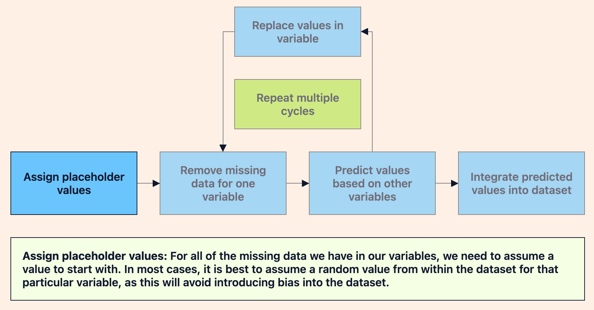

# Multiple Imputation

Try and try again

Imagine you are taking a final exam for a science class. As you go through the test, you find some questions that you can’t remember the answer to, so you decide to take a guess. Later on in the exam, you have jogged your memory a bit because some of the later questions have clues about the earlier answers. Luckily, you can use this new knowledge to go back and fill in the previous guesses — hopefully, you will get a better score on the exam!

This kind of iterative process happens all the time in various data and analytical systems, and is something that we can apply to missing data as well. This kind of technique is known as multiple imputation.

## What is Multiple Imputation:
_Multiple imputation_ is a technique for filling in missing data, in which we replace the missing data multiple times. Multiple imputation, in particular, is used when we have missing data across multiple categorical columns in our dataset. After we have tried different values, we use an algorithm to pick the best values to replace our missing data. By doing this, we are able to, over time, find the correct value for our missing data.

There are numerous algorithms that we can use, all with their own advantages and disadvantages. Overall, the general process for multiple imputation follows the below flow chart.



After each iteration, our predicted values for each variable should get more and more accurate, since the models continue to refine to better fit our dataset. The goal of multiple imputation is to fill in the missing data so that it can find a model — typically either a normal or chi-square model — to best fit the dataset.

## When to use it
Multiple imputation is a powerful technique for replacing missing data, but there are some requirements and considerations to take before using multiple imputation.

Multiple imputation is best for MAR data, so we should ensure that our data fits that description. With MAR missing data, there is an assumption that there is an underlying reason to have missing data, and we have a good understanding of why that data is missing. Since it is not completely random, using random data to fill in the blanks is not sufficient, so we must use the context of the rest of the data to help.

Assuming we meet the criteria for using multiple imputation, our dataset will receive a couple key benefits.


1. We can safely assume that our data won’t be biased, since we start the process off with a random assignment of values for the missing data.
2. Because the goal of multiple imputation is to have a model that fits the data, we can be pretty confident that the resulting data will be a close approximation of the real data. This would include calculations like standard error and overall statistics.

## How to use it
Now that we understand what multiple imputation is trying to do, let’s go ahead and try it out! We don’t have to create our own algorithm to fill in our data, as there are many different approaches and pre-built libraries that can help us out.

One place to start would be with the `IterativeImputer` module within `sklearn`. This module provides a library to perform Multiple Imputation, leveraging the existing frameworks with `sklearn` and `pandas` DataFrames. Let’s assume that we have the following dataset:

|   X  |   Y  |  Z  |
|:----:|:----:|:---:|
| 5.4  | 18.0 | 7.6 |
| 13.8 | 27.4 | 4.6 |
| 14.7 |      | 4.2 |
| 17.6 | 18.3 |     |
|      | 49.6 | 4.7 |
| 1.1  | 48.9 | 8.5 |
| 12.9 |      | 3.5 |
| 3.4  | 13.6 |     |
|      | 16.1 | 1.8 |
| 10.2 | 42.7 | 4.7 |

If we wanted to use the `IterativeImputer` module here, our code would look like the 
following:
```py
import numpy as np
from sklearn.experimental import enable_iterative_imputer
from sklearn.impute import IterativeImputer
import pandas as pd

# Create the dataset as a Python dictionary
d = {
    'X': [5.4,13.8,14.7,17.6,np.nan,1.1,12.9,3.4,np.nan,10.2],
    'Y': [18,27.4,np.nan,18.3,49.6,48.9,np.nan,13.6,16.1,42.7],
    'Z': [7.6,4.6,4.2,np.nan,4.7,8.5,3.5,np.nan,1.8,4.7]
}

dTest = {
    'X': [13.1, 10.8, np.nan, 9.7, 11.2],
    'Y': [18.3, np.nan, 14.1, 19.8, 17.5],
    'Z': [4.2, 3.1, 5.7,np.nan, 9.6]
}

# Create the pandas DataFrame from our dictionary
df = pd.DataFrame(data=d)
dfTest = pd.DataFrame(data=dTest)

# Create the IterativeImputer model to predict missing values
imp = IterativeImputer(max_iter=10, random_state=0)

# Fit the model to the test dataset
imp.fit(dfTest)

# Transform the model on the entire dataset
dfComplete = pd.DataFrame(np.round(imp.transform(df),1), columns=['X','Y','Z'])

print(dfComplete.head(10))
```

After running our code, our dataset now looks like this (the imputed values are in bold):

|   X  |   Y  |  Z  |
|:----:|:----:|:---:|
| 5.4  | 18.0 | 7.6 |
| 13.8 | 27.4 | 4.6 |
| 14.7 | 17.4 | 4.2 |
| 17.6 | 18.3 | 5.6 |
| 11.2 | 49.6 | 4.7 |
| 1.1  | 48.9 | 8.5 |
| 12.9 | 17.4 | 3.5 |
| 3.4  | 13.6 | 5.7 |
| 11.2 | 16.1 | 1.8 |
| 10.2 | 42.7 | 4.7 |

As we can see, the imputed data looks and behaves much like the rest of the dataset. With only a few lines of code, we can use a library like this to fill in our missing data to the best of our ability.

### Coding Question
Use the IterativeImputer module within sklearn to impute the missing data values.

    Use 10 iterations.
    Set random_state to 1.

Set dfComplete equal to the resulting DataFrame.

```py
import numpy as np
from sklearn.experimental import enable_iterative_imputer
from sklearn.impute import IterativeImputer
import pandas as pd

d = {
    'D': [6.9,np.nan,5.4,4.7,4.5,5.1,4.1,4.5,np.nan,7.5],
    'E': [18.5,21.9,np.nan,21.2,12.4,16.7,11,11.5,21.6,np.nan],
    'F': [np.nan,36.3,50.6,48.7,51.9,np.nan,51.6,50.1,46.9,36.6],
    'G': [80,70.1,94.5,np.nan,76.3,84.6,np.nan,93.6,68.9,82]
}

dTest = {
    'D': [5.6,np.nan,4.5,3.2,5.9],
    'E': [16.1,20.7,np.nan,22.4,13.4],
    'F': [np.nan,31.2,53.2,47.8,50.8],
    'G': [79.9,71.3,92.4,np.nan,75.6]
}

# Define df and dfTest as pandas DataFrames 
df = pd.DataFrame(data=d)
dfTest = pd.DataFrame(data=dTest)

# Create the IterativeImputer model to predict missing values
imp = IterativeImputer(max_iter=10, random_state=1)

# Fit the model to the test dataset
imp.fit(dfTest)

# Transform the model on the entire dataset
dfComplete = pd.DataFrame(np.round(imp.transform(df),1), columns=['D','E','F', 'G'])

# Uncomment the following statement to print the result
print(round(dfComplete.mean(),2))
```


