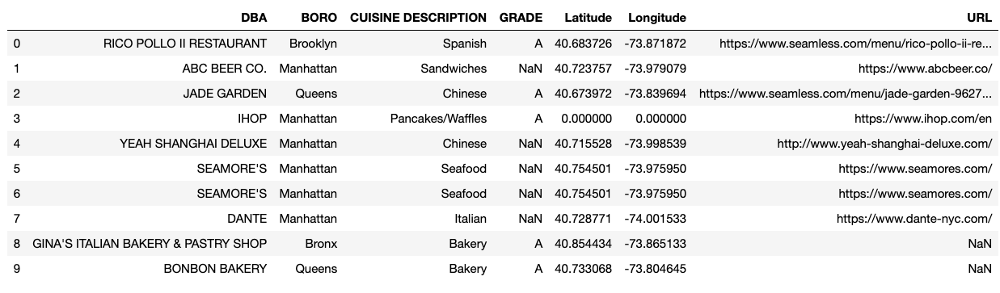
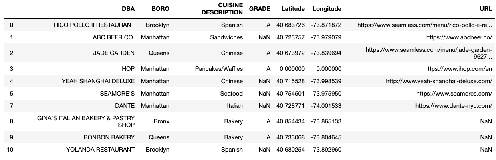
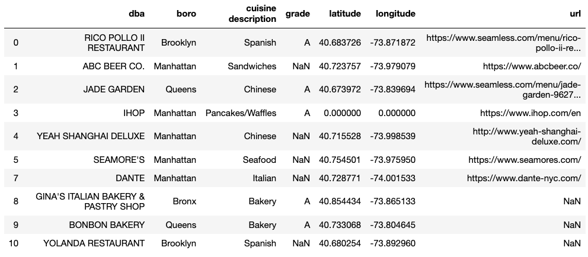
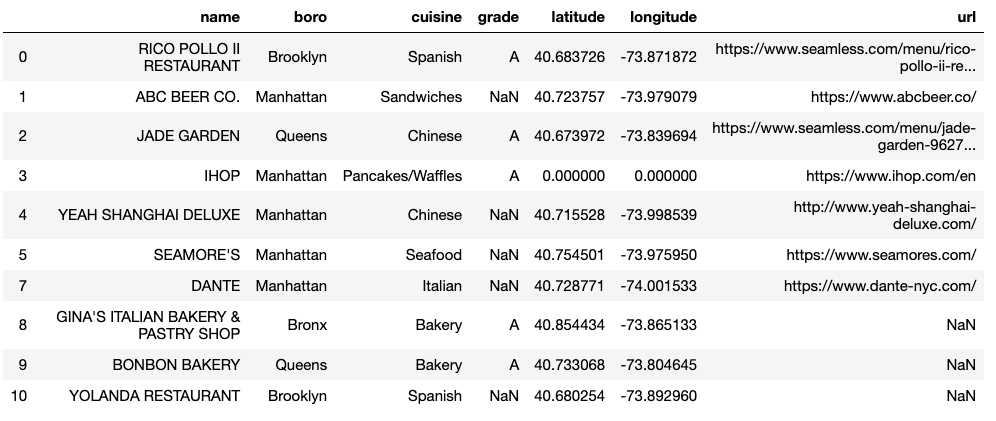
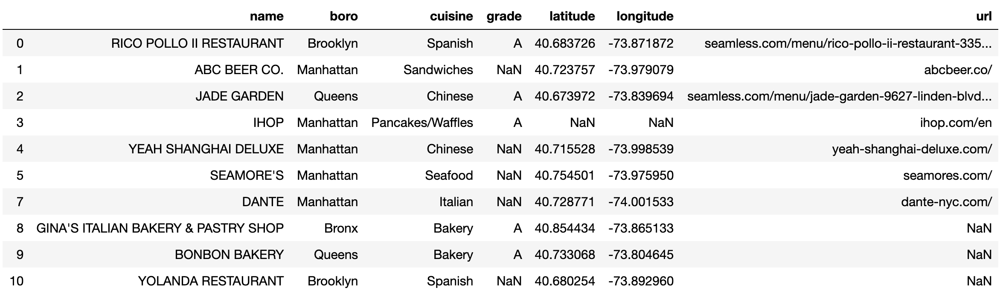
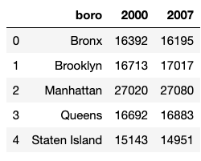
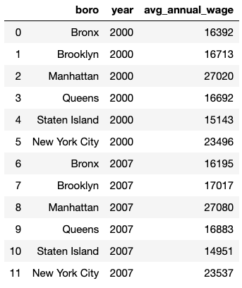

# Introduction to Data Wrangling and Tidying

Frequently when we work with data, we encounter unstructured and/or messy data. Messy data can take a variety of forms. This could mean any of the following:
* The columns are mislabeled or do not have variable names.
* The dataset contains nonsensical data.
* Variables are stored in both the columns and rows.

While the data may be messy, it is still extremely informative. We need to clean, transform, and sometimes manipulate the data structure to gain any insights. This process is often called data wrangling or data munging.

At the final stages of the data wrangling process, we will have a dataset that we can easily use for modeling purposes or for visualization purposes. This is a tidy dataset where each column is a variable and each row is an observation.


# Data Wrangling
Let’s look at a subset of restaurant inspections from the [New York City Department of Health and Mental Hygiene (NYC DOHMH)](https://data.cityofnewyork.us/Health/DOHMH-New-York-City-Restaurant-Inspection-Results/43nn-pn8j) to work through some data wrangling processes. The data includes seven different columns with information about a restaurant’s location and health inspection. Here is a description of the dataset’s variables. 

|  Pos. |       Var. Name      |            Var. Description            |
| ----- | -------------------- | -------------------------------------- |
| 0     | DBA                  | Restaurant name                        |
| 1     | BORO                 | Borough                                |
| 2     | CUISINE DESCRIPTION  | Type of cuisine                        |
| 3     | GRADE                | Letter grade                           |
| 4     | LATITUDE             | Latitude coordinates of restaurant     |
| 5     | LONGITUDE            | Longitude coordinates of restaurant    |
| 6     | URL                  | URL link to restaurant's website       |

Let’s use the `read_csv()` function in pandas to load our dataset as a pandas dataframe and take a look at the first 10 rows out of the 27 total.

```py
import pandas as pd
restaurants = pd.read_csv("DOHMH_restaurant_inspections.csv")

# the .head(10) function will show us the first 10 rows in our dataset
print(restaurants.head(10))
```



```py
# the .shape method in pandas identifies the number of rows and columns in our dataset as (rows, columns)
restaurants.shape  
```
```
(27, 7) 
```


When we look closely at the table, we see some missing data. In both `GRADE` and `URL` columns, we have missing values marked as NaNs. In the `Latitude` and `Longitude` columns, we have a missing set of coordinates marked as (0.000, 0.000) for IHOP. (0.000, 0.000) is the label for missing coordinates because no restaurants in New York City are at the equator. Other common indicators used for missing values are values that are NA and -.

## Preliminary data cleaning

There are also duplicate rows for the restaurant labeled Seamore’s. To remove any duplicate rows, we can use the `drop_duplicates()` function 

```py
# the .drop_duplicates() function removes duplicate rows
restaurants = restaurants.drop_duplicates() 

# the .head(10) function will show us the first 10 rows in our dataset
print(restaurants.head(10))
```



```py
# the .shape method in pandas identifies the number of rows and columns in our dataset as (rows, columns)
restaurants.shape 
```
```
(25, 7) 
```

After dropping duplicate rows, we are left with 25 rows and can now see “YOLANDA RESTAURANT” at the bottom when looking at our dataset’s first 10 rows.

If we look at the first four columns of our data: `DBA`, `BORO`, `CUISINE DESCRIPTION`, and GRADE. These column names are all capitalized, while the columns following it use both uppercase and lowercase. To have some consistency across column names, we will iterate over the column names of our dataset and convert them all to lowercase using the `map()` and `lower()` functions. We also need to make sure to include the `str` function to identify that we are working with strings.
```py
# map() applies the str.lower() function to each of the columns in our dataset to convert the column names to all lowercase
restaurants.columns = map(str.lower, restaurants.columns)

# the .head(10) function will show us the first 10 rows in our dataset
print(restaurants.head(10))  
```



You may have noticed that the first column of the dataset is called `DBA`, but we know it is a column with restaurant names. We can use the `rename()` function and a dictionary to relabel our columns. While we are renaming our columns, we might also want to shorten the `cuisine description` column to just `cuisine`.

```py
# axis=1` refers to the columns, `axis=0` would refer to the rows
# In the dictionary the key refers to the original column name and the value refers to the new column name {'oldname1': 'newname1', 'oldname2': 'newname2'}
restaurants = restaurants.rename({'dba': 'name', 'cuisine description': 'cuisine'}, axis=1)


# the .head(10) function will show us the first 10 rows in our dataset
print(restaurants.head(10))
```



# Data Types

Great! Now we have a dataset that is cleaner and much easier to read!. Let’s take a look at each column’s data types by appending .dtypes to our pandas dataframe.
```py
restaurants.dtypes
```

```
name         object
boro         object
cuisine      object
grade        object
latitude     float64
longitude    float64
url          object
dtype: object
```

We have two types of variables: object and float64. `object` can consist of both strings or mixed types (both numeric and non-numeric), and `float64` are numbers with a floating point (ie. numbers with decimals). There are other data types such as `int64` (integer numbers), `bool` (True/False values), and `datetime64` (date and/or time values).

Since we have both continuous (float64) and categorical (object) variables in our data, it might be informative to look at the number of unique values in each column using the `nunique()` function.

```py
# .nunique() counts the number of unique values in each column 
restaurants.nunique() 
```

```
name         25
boro          4
cuisine      15
grade         1
latitude     24
longitude    24
url          16
```

We see that our data consists of 4 boroughs in New York and 15 cuisine types. We know that we also have missing data in `url` from our initial inspection of the data, so the unique number of values in `url` might not be super informative. Additionally, we have corrected for duplicate restaurants, so the restaurant name, latitude, longitude, and url should be unique to each restaurant (unless, of course, there are some restaurant chains at different locations).

## Missing Data
From our initial inspection of the data, we know we have missing data in `grade`, `url`, `latitude`, and `longitude`. Let’s take a look at how the data is missing, also referred to as missingness. To do this we can use `isna()` to identify if the value is missing. This will give us a boolean and indicate if the observation in that column is missing (True) or not (False). We will also use `sum()` to count the number of missing values, where `isna()` returns True.
```py
# counts the number of missing values in each column 
restaurants.isna().sum() 
```

```
name          0
boro          0
cuisine       0
grade        15
latitude      0
longitude     0
url           9
```

We see that there are missing values in `grade` and `url`, but no missing values in `latitude` and `longitude`. However, we cannot have coordinates at (0.000, 0.000) for any of the restaurants in our dataset, and we saw that these exist in our initial analysis. Let’s replace the (0.000,0.000) coordinates with NaN values to account for this. We will use the `where()` function to replace the coordinates 0.000 with `np.nan`.
``` py
# here our .where() function replaces latitude values less than 40 with NaN values
restaurants['latitude'] = restaurants['latitude'].where(restaurants['latitude'] < 40, np.nan) 

# here our .where() function replaces longitude values greater than -70 with NaN values
restaurants['longitude'] = restaurants['longitude'].where(restaurants['longitude'] > -70, np.nan) 

# .sum() counts the number of missing values in each column
restaurants.isna().sum() 
```

```
name          0
boro          0
cuisine       0
grade        15
latitude      2
longitude     2
url           9
```

Now we see that latitude and longitude each have two missing data points thanks to replacing the (0.000, 0.000) values with NaN values.

## Characterizing missingness with crosstab

Let’s try to understand the missingness in the `url` column by counting the missing values across each borough. We will use the `crosstab()` function in pandas to do this.

The `crosstab()` computes the frequency of two or more variables. To look at the missingness in the `url` column we can add `isna()` to the column to identify if there is an NaN in that column. This will return a boolean, True if there is a NaN and False if there is not. In our crosstab, we will look at all the boroughs present in our data and whether or not they have missing url links. 
```py
pd.crosstab(
 
        # tabulates the boroughs as the index
        restaurants['boro'],  

        # tabulates the number of missing values in the url column as columns
        restaurants['url'].isna(), 

        # names the rows
        rownames = ['boro'],

        # names the columns 
        colnames = ['url is na']) 
```
```
url is na   False   True
boro        
Bronx         1   1
Brooklyn       2      4
Manhattan     11      2
Queens       2    2
```

We see that most of the restaurants in Manhattan in our dataset have restaurant links, while most restaurants in Brooklyn do not have url links. 

## Removing prefixes

It might be easier to read what url links are by removing the prefixes of the websites, such as `“https://www.”`. We will use `str.lstrip()` to remove the prefixes. Similar to when we were working with our column names, we need to make sure to include the `str` function to identify that we are working with strings and `lstrip` to remove parts of the string from the left side.

```py
# .str.lstrip('https://') removes the “https://” from the left side of the string
restaurants['url'] = restaurants['url'].str.lstrip('https://') 

# .str.lstrip('www.') removes the “www.” from the left side of the string
restaurants['url'] = restaurants['url'].str.lstrip('www.') 

# the .head(10) function will show us the first 10 rows in our dataset
print(restaurants.head(10))
```



Amazing! Our dataset is now much easier to read and use. We have identifiable columns and variables that are easy to work with thanks to our data wrangling process. We also corrected illogical data values and made the strings a little easier to read.

In this example, we worked with data that was rather tidy, in the sense that each row was an observation (a restaurant) and each column was a variable. However, what if our dataset was not tidy? What if our columns and rows needed reorganization?

## Tidy Data
Let’s take a look at a dataset that has information about the average annual wage for restaurant workers across New York City boroughs and New York City as a whole from the years 2000 and 2007. The data is from the [New York State Department of Labor](https://labor.ny.gov/stats/ins.asp), Quarterly Census of Employment and Wages,and only contains six total rows.

```py
annual_wage = pd.read_csv("annual_wage_restaurant_boro.csv")
print(annual_wage)
```




There are three variables in this dataset: `borough`, `year`, and `average annual income`. However, we have values (2000 and 2007) in the column headers rather than variable names (`year` and `average annual income`). This is not ideal to work with, so let’s fix it! We will use the `melt()` function in pandas to turn the current values (2000 and 2007) in the column headers into row values and add `year` and `avg_annual_wage` as our column labels. 

```py
annual_wage=annual_wage.melt(

      # which column to use as identifier variables
      id_vars=["boro"], 
      
      # column name to use for “variable” names/column headers (ie. 2000 and 2007) 
      var_name=["year"], 

      # column name for the values originally in the columns 2000 and 2007
      value_name="avg_annual_wage") 

print(annual_wage)
```



Now we have a tidy dataset where each column is a variable (borough, year, or average annual wage), and each row is an observation! This dataset will be much easier to work with moving forward!

You now have the tools to continue to gather more information about New York City restaurants to answer questions you are interested in exploring. For example, we could explore what variables are most predictive of receiving a passing health score. We would need to gather some more data and go through the data wrangling process to end up with tidy data that is ready for analysis.