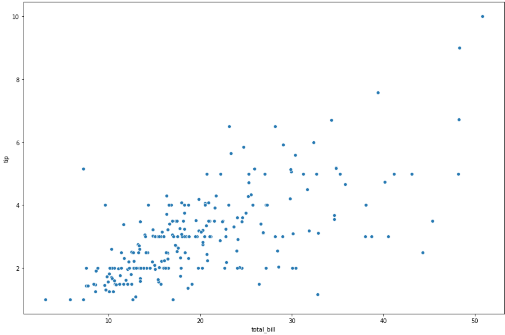
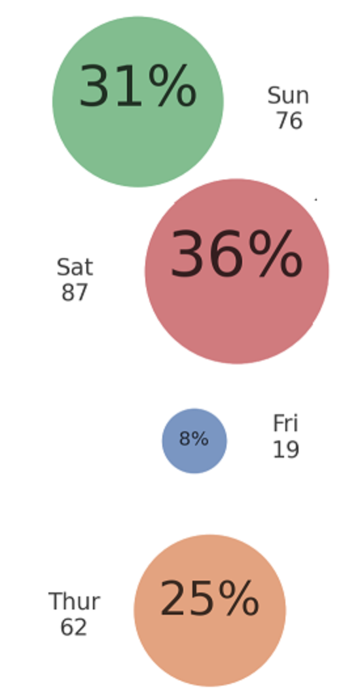

# Communicating Data Science Findings
Data Science is as much about storytelling as it is about coding and data wrangling. The reason Data Scientists are in such high demand recently is because of their abilities to translate the performance and health of a company by gathering previously unavailable insights from its data. It might seem like an easy and obvious thing at the moment, but in reality, a company’s data might be so jumbled and unstructured that mere mortals are unable to make any sense of it.

## Best Practices for Communicating Data Science Findings
A Data Scientist explaining to a group of Product Managers that the covariance between two variables shows no visible linear relationship is like Dumbledore teaching a group of Jedi how to conjure up a Patronus. Two different worlds. Does not compute.

The transformation of data analysis results by Data Scientists into easily accessible and understandable mediums for everyone to understand is actually one of the most important skills on the job.

After a Data Scientist completes an in-depth investigation on some set of data, the results of this investigation need to be converted somehow into a simplified summary for others to observe and understand. Usually, these kinds of summaries are written up as comments to one of your assigned tickets or more often as slides in a presentation that you then verbally discuss in further detail.

## Know Your Audience

Before starting the process of communicating your findings, it’s important to put into perspective who your audience actually is. The entire tone of your presentation is shaped and changed by how individuals will perceive it.

Imagine you’re presenting information about tipping and restaurant billing transactions to a group of restaurant owners. How would your presentation look? Now imagine you’re showing the same data to a group of developers who are creating a food delivery app. How would your presentation be different for this audience than your first one?

If you put too much math/statistics jargon into a report or presentation for non-technical people, they’re either going to ask you to define things for them or ask for you to clarify upon certain concepts. Hand it over too simplified to a technical audience, however, and they’ll ask you how you came up with your results.

You need to find the perfect blend between these two to correctly adapt your communication.

## Structure The Sequence Of Your Story

A structure defines in what sequence you reveal the results of your analysis. During this process, you also want to determine how much analytical depth you want to dive into. This is an opportunity to highlight only the most important observations you derived from the data through your exploration of it.

The type of observations you want to include is the kind that relates most to whatever the ultimate goal for the investigation is. If for example, you notice a completely unrelated trend in user behavior relative to your analysis, save it as an additional discussion point inside of an appendix at the end somewhere in your slides or report. Sometimes an audience member might also pick up on this additional detail and ask you about it during a Q&A session. This type of structure allows you to quickly go to your appendix and pick out a slide that goes more in-depth on a previously alluded detail.

## Find and pick relevant data

Are all of the insights you gathered from your data absolutely necessary to discuss? Does it help get your ultimate point across or is it just extra fluff you think is neat as a Data Scientist?

Sometimes, additional statistics that help a Data Scientist to take a particular investigative path may not be the ideal insights to share with the audience. If a number of features are vague in their immediate representation and don’t explain some kind of requested result, it’s better to pass on them.

The following is an example of a visualization of the tipping and restaurant transaction data. The visualization has had no adjustments and no added arguments. On the X-axis we have the total bill amount, and on the Y-axis we have the tip amount. The labels are small, there is no title, and the only immediate thing you can extract from it is the higher the bill, the higher the tip, which kind of seems obvious.

This is a rookie mistake in the Data Science field when trying to communicate findings through visualizations. We shouldn’t look at a chart and think _What is this chart’s purpose?_

_A little bland, no?_ Later in the article we’ll focus on making it look a little more useful and easier to understand.

## Choose proper methods of visualization

Contrary to popular belief, your data usually has a finite set of visualization types you should probably apply to it. Some examples include bar-charts and count-plots for categorical data, time-series charts for datetime type data, and lineplots/boxplots or histograms for continuous and numeric type data.

For example:

What is this visualization trying to tell us?

Using the wrong combination here will not only end up confusing the audience but could sacrifice the audiences’ trust in you and your ability to deliver reliable analyses. For example, seeing a bubble plot type visualization on a website or in a magazine might look cool at first, but writing so much code to put circles behind 7 numbers is just silly. The visualization above could have just been easily put into a table without any effort and much quicker to read.

## Complexity and Purpose

Don’t let your visualizations become too noisy. You don’t need to show a plot of every single possible combination of correlations for every single variable.

Focus only on the features important within your dataset to prevent introducing way too much information at one time to your audience. This includes defining maximum thresholds for how many segmented or grouped trends to picture in one visualization.

Another mistake made when trying to communicate a large magnitude of data is trying to fit it all in one visualization. In cases where you’d like to plot multiple trends in your data, it may sometimes be a better idea to just split it up into separate charts.

The following line plot shows the linear relation between bill amount and tips on different days. There are actually only four days included in this dataset, but if we took out the legend and asked what you see, the only response we would expect to hear is _spaghetti_:

Since the trend for the tip amount seems to stay relatively similar on different days, there’s no real reason to visualize each day separately. The only reason Friday looks like a more stable behavior is that there is less data. If this dataset contained some kind of datetime variable and was much bigger, another approach would be to average out or sum the transactions by each date contained in the X-axis. In this case, you would have to add additional ticks in the X-axis to help signify the days of the week but would look much cleaner.

# Conclusion

Data always starts out messy, ugly, and confusing. The simplest way of getting an audience to have a feel for a data-focused concept is through visualization. When using visualization to present your findings, remember the following:

* Visualizations are like jokes, if you don’t immediately understand them… they’re probably not very good.
* Know who your audience is.
* Make sure your visualization has a purpose and is somehow tied to the ultimate conclusion of your findings because irrelevant topics sometimes make your audience lose interest.
* Make sure you are using relevant data.
* Choose a proper method of visualization.
* Use large, short labels on your graphs so that people can quickly understand what the markers or line in a chart actually mean.
* Try to simplify concepts without using any technical jargon that makes the data look messy again.

As you venture out of analytics and into other parts of the Data Science spectrum, there are going to be additional factors that come into play to best communicate your findings; however, no matter the area of Data Science you focus on, the practices mentioned here are always going to stay relevant.