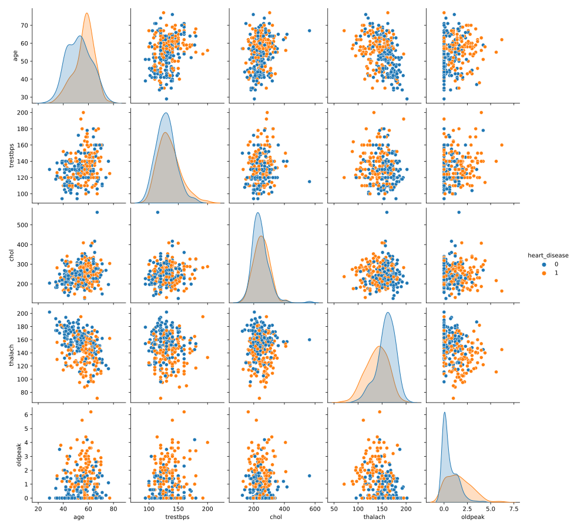
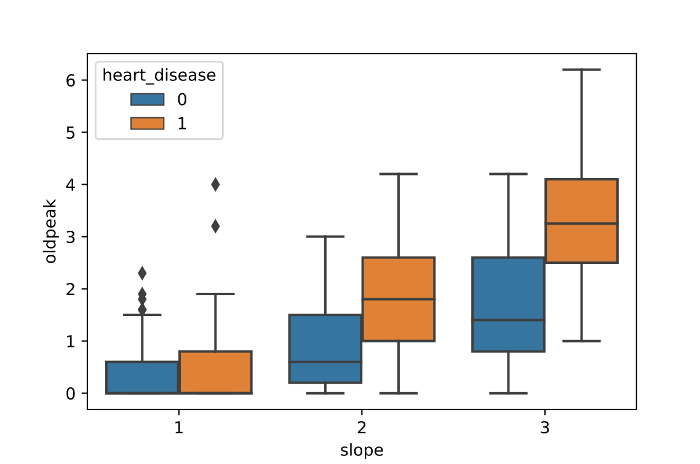
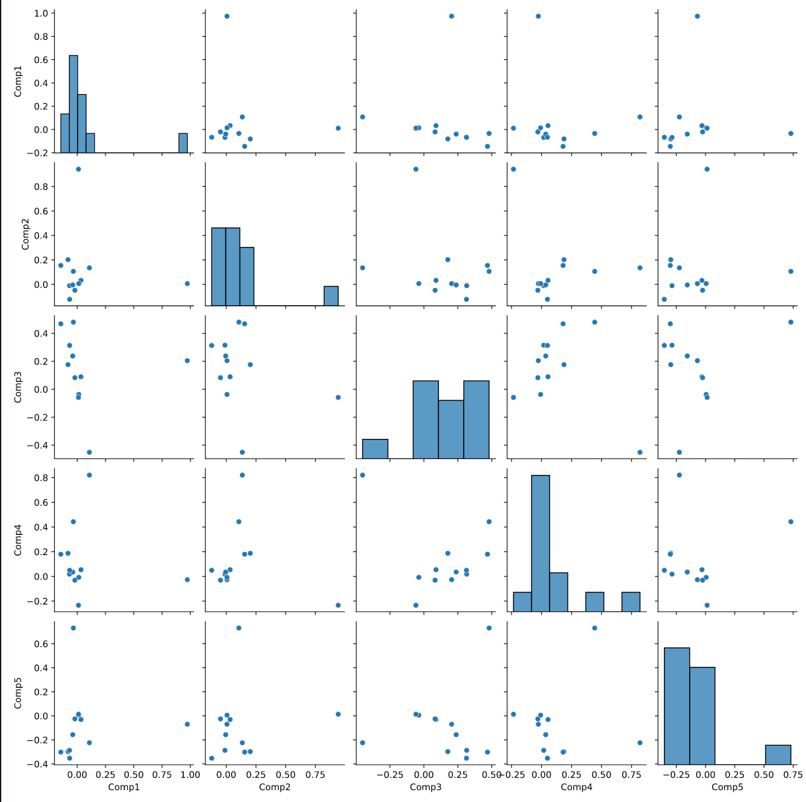

# EDA Prior to Fitting a Classification Model
# Introduction

Similar to regression models, it is important to conduct EDA before fitting a classification model. An EDA should check the assumptions of the classification model, inspect how the data are coded, and check for strong relationships between features. In this article, we will explore some of the EDA techniques that are generally employed prior to fitting a classification model.

# Data
Suppose we want to build a model to predict whether a patient has heart disease or not based on other characteristics about them. We have downloaded a dataset from the [UCI Machine Learning Repository](http://archive.ics.uci.edu/ml/datasets/Heart+Disease) about heart disease which contains patient information such as:

* `age`: age in years
* `sex`: male (1) or female (0)
* `cp`: chest pain type
* `trestbps`: resting blood pressure (mm Hg)
* `chol`: cholesterol level
* `fbs`: fasting blood sugar level (normal or not)
* `restecg`: resting electrocardiograph results
* `thalach`: maximum heart rate from an exercise test
* `exang`: presence of exercise-induced angina
* `oldpeak`: ST depression induced by exercise relative to rest
* `slope`: slope of peak exercise ST segment
* `ca`: number of vessels colored by flourosopy (0 through 3)
* `thal`: type of defect (3, 6 or 7)

The response variable for this analysis will be ``heart_disease``, which we have condensed down to either 0 (if the patient does not have heart disease) or 1 (the patient does have heart disease).

EDA is extremely useful to better understand which patient attributes are highly related to heart disease, and ultimately to build a classification model that can accurately predict whether someone has heart disease based on their measurements. By exploring the data, we may be able to see which variables — or which combination of variables — provide the most information about whether or not the patient has heart disease.

# Preview the data
Similar to EDA prior to a regression model, it is good to begin EDA with inspecting the first few rows of data:

```py
print(heart.head())
```

|   | age | sex | cp | trestbps | chol | fbs | restecg | thalach | exang | oldpeak | slope | ca | thal | heart_disease |
|:-:|:---:|:---:|:--:|:--------:|:----:|:---:|:-------:|:-------:|:-----:|:-------:|:-----:|:--:|:----:|:-------------:|
| 0 | 63  | 1   | 1  | 145      | 233  | 1   | 2       | 150     | 0     | 2.3     | 3     | 0  | 6    | 0             |
| 1 | 67  | 1   | 4  | 160      | 286  | 0   | 2       | 108     | 1     | 1.5     | 2     | 3  | 3    | 2             |
| 2 | 67  | 1   | 4  | 120      | 229  | 0   | 2       | 129     | 1     | 2.6     | 2     | 2  | 7    | 1             |
| 3 | 37  | 1   | 3  | 130      | 250  | 0   | 0       | 187     | 0     | 3.5     | 3     | 0  | 3    | 0             |
| 4 | 41  | 0   | 2  | 130      | 204  | 0   | 2       | 172     | 0     | 1.4     | 1     | 0  | 3    | 0             |

By looking at the first rows of data, we can note that all of the columns appear to contain numbers. We can quickly check for missing values and data types by using `.info()`:

```py
print(heart.info())
```

Output:
```py
Data columns (total 14 columns):
 #   Column         Non-Null Count  Dtype  
---  ------         --------------  -----  
 0   age            303 non-null    int64  
 1   sex            303 non-null    int64  
 2   cp             303 non-null    int64  
 3   trestbps       303 non-null    int64  
 4   chol           303 non-null    int64  
 5   fbs            303 non-null    int64  
 6   restecg        303 non-null    int64  
 7   thalach        303 non-null    int64  
 8   exang          303 non-null    int64  
 9   oldpeak        303 non-null    float64
 10  slope          303 non-null    int64  
 11  ca             303 non-null    object 
 12  thal           303 non-null    object 
 13  heart_disease  303 non-null    int64  
dtypes: float64(1), int64(11), object(2)
```

We can see that all columns have a count of “303 non-null” values, meaning there are no blank spaces in the dataset. However, there can still be other ways that missing data can be hiding in the data. For example, `ca` and `thal` are `object` data types, indicating that there is at least one character in each of these columns which are preventing the variable from being read as a numeric data type. This could be either an input mistake (such as the letter “o” in place of a “0”), or it can be an indication of how missing data were handled. Depending on which model program is used, you may have to find and remove the observations with characters before proceeding with the model.

We also want to make sure to check how categorical data is encoded before proceeding with model fitting. For example, `cp` is the patient’s chest pain type and is indicated by a number between 1 and 4. These numbers are intended to be treated as groups, so this variable should be changed into an object before continuing into the analysis.

# Pair plot
We can explore the relationships between the different numeric variables using a pair plot. If we also color the observations based on heart disease status, we can simultaneously get a sense for a) which features are most associated with heart disease status and b) whether there are any pairs of features that are jointly useful for determining heart disease status:



In this pair plot, we are looking for patterns between the two color groups. Looking at the density plots along the diagonal, there are no features that cleanly separate the groups (age has the most separation). However, looking at the scatterplot for `age` and `thalach` (maximum heart rate from an exercise test), there is more clear separation. It appears that patients who are old and have low `thalach` are more likely to be diagnosed with heart disease than patients who are young and have high `thalach`. This suggests that we want to make sure both of these features are included in our model.

# Correlation heat map

Similar to linear regression, some classification models assume no multicollinearity in the data, meaning that two highly correlated predictors should not be included in the model. We can check this assumption by looking at a correlation heat map:


There is no set value for what counts as “highly correlated”, however a general rule is a correlation of 0.7 (or -0.7). There are no pairs of features with a correlation of 0.7 or higher, so we do not need to consider leaving any features out of our model based on multicollinearity.


# Further exploration

You can use more complex visualizations to examine the relationships between 2 or more features and the response variable at the same time. For example, the following boxplots show the relationship between `oldpeak`, `slope`, and `heart_disease`:



In this boxplot, we can see a pretty distinct difference between those with heart disease and those without at slope level 3. Seeing this distinction indicates that on average `oldpeak` is connected to heart disease at different `slope` levels. This gives insight that it might be beneficial to include an interaction term between `oldpeak` and `slope` in a linear regression model.

# Classification model results
After this EDA, we can run a principal component analysis (PCA), which attempts to identify which features (or combination of features) are highly related to heart disease. Ideal results of a PCA show one or more pairs of principal components with some separation between the colored groups:



We can see here that there are not any clear separations, which would indicate that this is not an effective analysis. However, we might use the weights of the components to further explore relationships between features and use that in other analyses.

# Conclusion

Exploring the data in the ways outlined above will help prepare you to build an effective classification model. These steps ensure that the data is properly coded and can be useful for both feature selection and model tuning.