# EDA Prior to Unsupervised Clustering

# Introduction

When we want to understand underlying groups for a set of observations but don’t know what the group labels should be, we often turn to unsupervised clustering. If we are planning to fit an unsupervised machine learning model, we often want to explore questions such as:

* How many groups are there?
* How might those groups differ?

In this article, we will demonstrate an exploratory process for beginning to address these questions.

# Data
Let’s say that you are opening a restaurant and want to be sure to offer a “wide variety” of wines. You get this dataset of chemical differences between types of wines from the [UCI Machine Learning Repository](https://archive.ics.uci.edu/ml/datasets/wine) with traits such as:

* Alcohol
* Malic acid
* Ash
* Alcalinity of ash
* Magnesium
* Total phenols
* Flavanoids
* Nonflavanoid phenols
* Proanthocyanins
* Color intensity
* Hue
* OD280/OD315 of diluted wines
* Proline

You want to use this information to try to categorize the wine into different groups to ensure that the wines that you decide to buy for the restaurant have a good amount of variety. You want the wines within each group to be similar to each other, and wines in different groups to be less similar. You have no idea how many groups there are or what the group labels should be. So instead, you want to see if the given information has natural groupings based on the characteristics that you have collected data about.

In order to get started, you might need to answer some of the following questions:

* How many different kinds of wine are there?
* How do those wine types differ?

For some unsupervised clustering algorithms, you’ll need to specify the number of groups ahead of time. Also, different types of algorithms can handle different kinds of groupings more efficiently, so it can be helpful to visualize the shapes of the clusters. For example, k-means algorithms are good at identifying data groups with spherical shapes because they are based on principles of equal variance and distance between data points:

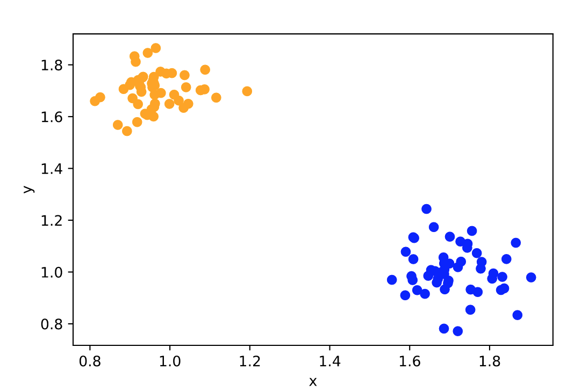

On the other hand, Principal Component Analysis algorithms and BIRCH methods are better at identifying elongated groupings:

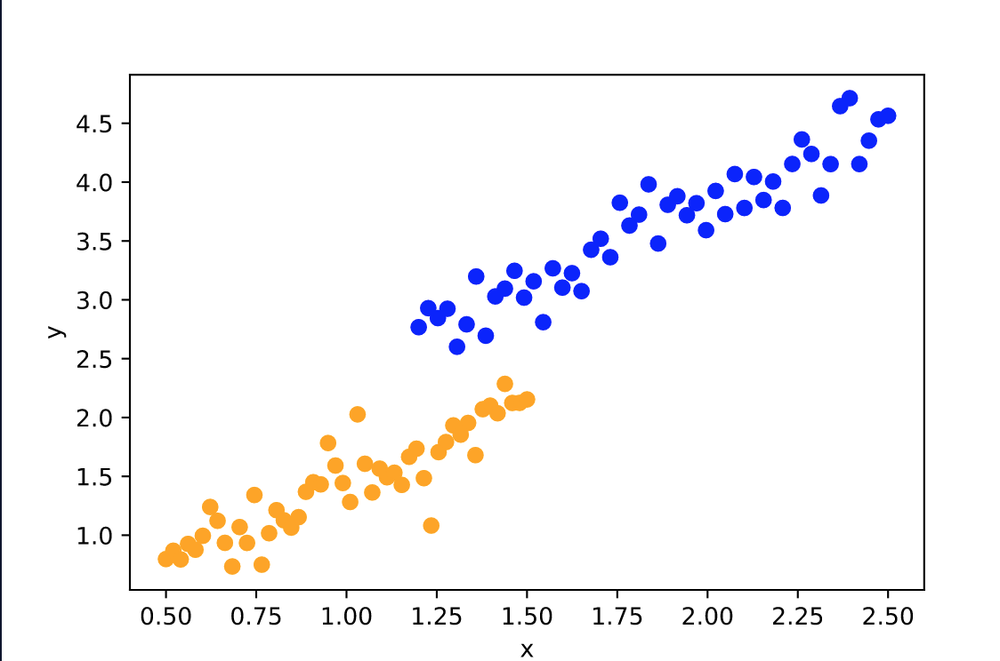

There is no method that is the best in every situation. It takes some investigating to know which method will be best for a given set of data.

# Prepare the data

As usual, before we analyze the data, we should go through the process of previewing the data:

|   | Alcohol | Malic_Acid |  Ash | Ash_Alcanity | Magnesium | Total_Phenols | Flavanoids | Nonflavanoid_Phenols | Proanthocyanins | Color_Intensity |  Hue | OD280 | Proline |
|:-:|:-------:|:----------:|:----:|:------------:|:---------:|:-------------:|:----------:|:--------------------:|:---------------:|:---------------:|:----:|:-----:|:-------:|
| 0 | 14.23   | 1.71       | 2.43 | 15.6         | 127       | 2.80          | 3.06       | 0.28                 | 2.29            | 5.64            | 1.04 | 3.92  | 1065    |
| 1 | 13.20   | 1.78       | 2.14 | 11.2         | 100       | 2.65          | 2.76       | 0.26                 | 1.28            | 4.38            | 1.05 | 3.40  | 1050    |
| 2 | 13.16   | 2.36       | 2.67 | 18.6         | 101       | 2.80          | 3.24       | 0.30                 | 2.81            | 5.68            | 1.03 | 3.17  | 1185    |
| 3 | 14.37   | 1.95       | 2.50 | 16.8         | 113       | 3.85          | 3.49       | 0.24                 | 2.18            | 7.80            | 0.86 | 3.45  | 1480    |
| 4 | 13.24   | 2.59       | 2.87 | 21.0         | 118       | 2.80          | 2.69       | 0.39                 | 1.82            | 4.32            | 1.04 | 2.93  | 735     |

Before continuing with our analysis, we will want to clean and standardize the data, as well as ensure that the variables are coded appropriately as numerical values.

# Pairplot to look for clusters
A pairplot of the variables is a good way to look for univariate and bivariate clusters.

Looking at the histograms along the diagonal, some variables have what appear to be bimodal distributions, as indicated by the two peaks. Let’s take a closer look at a couple of them:

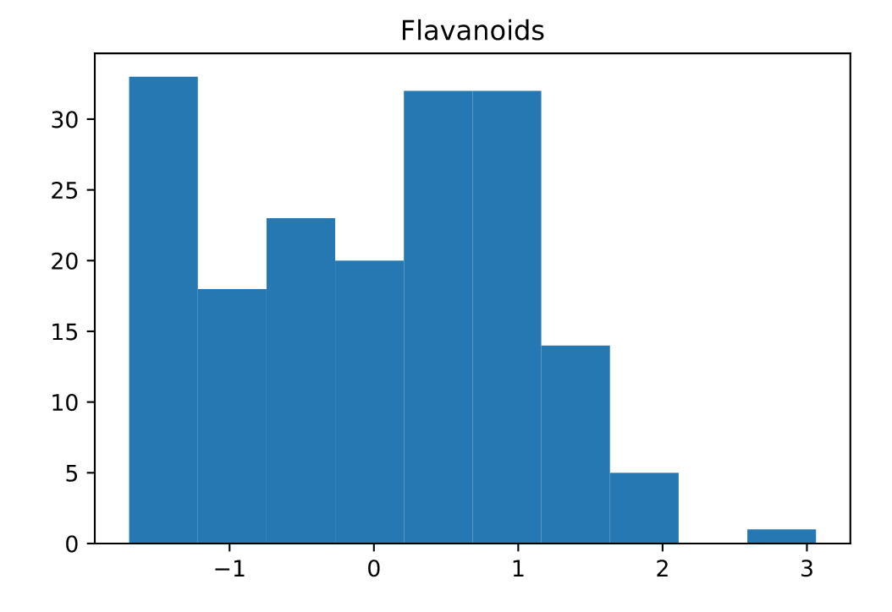

In this histogram of `Flavanoids`, we can see a peak at the very left-hand side as well as between 0 and 1. This is evidence that there could be two groups of wines with respect to `Flavanoids` (low and high flavanoid wines).

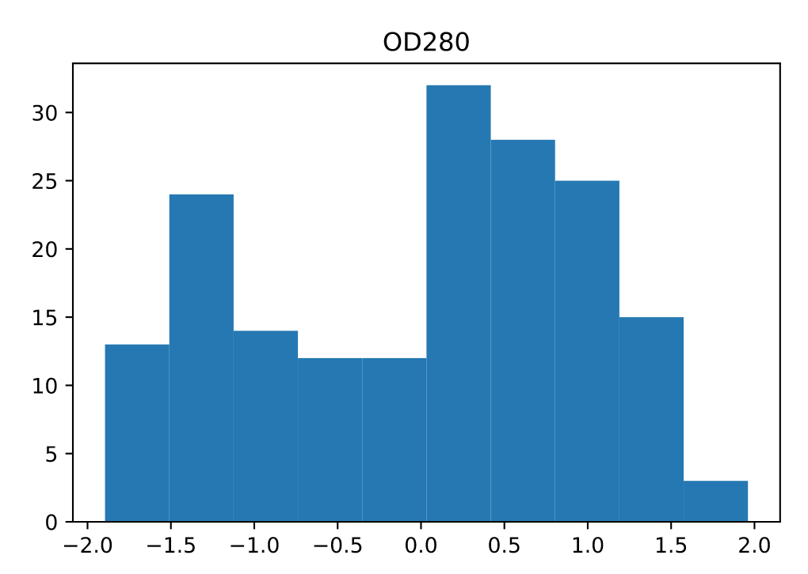

Similarly, the variable of `OD280` has two distinct peaks, one between -1.5 and -1, and another between 0 and 0.5. Thus, we have evidence of at least two wine groups based on `OD280` as well.

Looking at the rest of the pair plot, it is difficult to see relationships in the scatterplots when there are this many variables. The task of looking at each scatterplot can be tedious, so we have selected three bivariate plots to highlight:

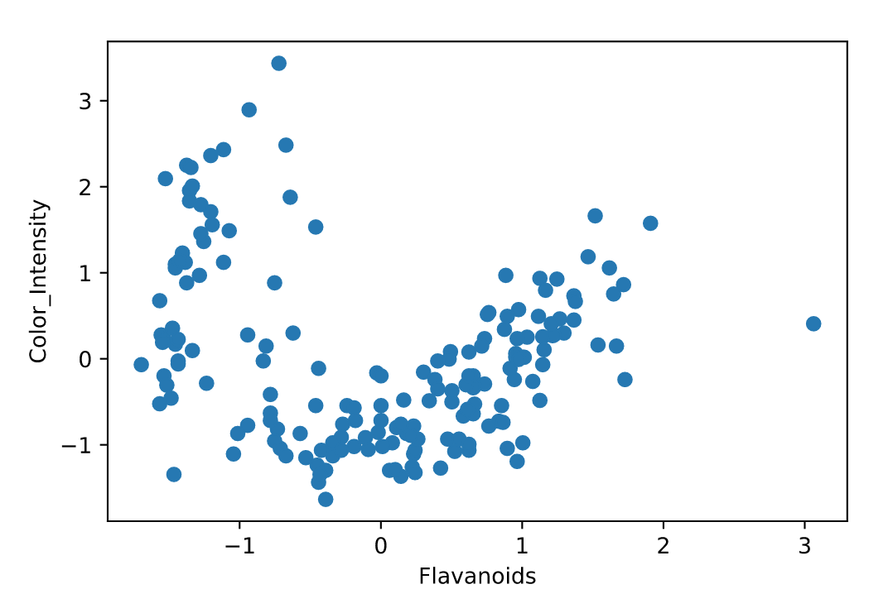

This first scatterplot is between `Flavanoids` and `Color_Intensity`. In this plot, we see at least two clear elongated clusters.

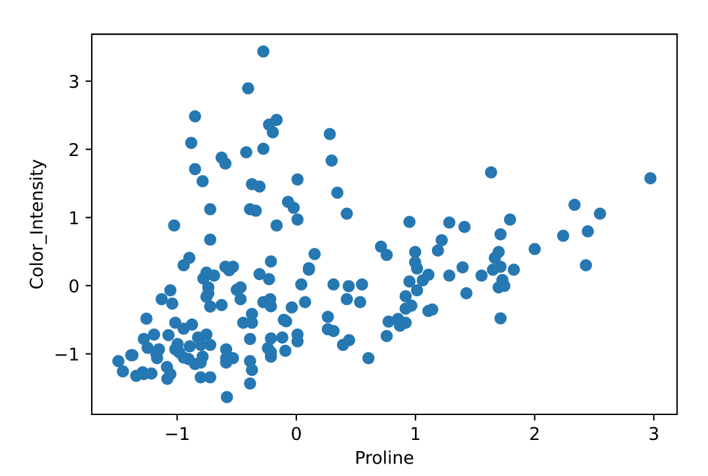
This second scatterplot is between `Proline` and `Color_Intensity` and appears to have at least three different clusters.

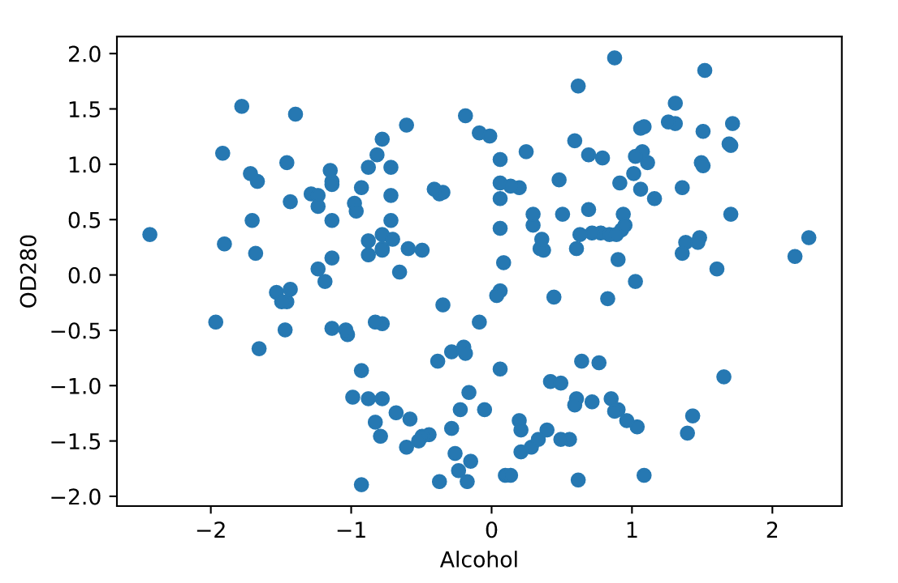

This final scatterplot is between `Alcohol` and `OD280` and contains three distinct round blobs of points.

Based on these plots we can conclude that there are probably at least three different types of wine in this dataset and that `Flavanoids`, `Color_Intensity`, `Alcohol`, and `OD280` may be particularly important in distinguishing those groups.

# Feature reduction for EDA
The first pair plot with all of the variables was difficult to inspect, but we can reduce the number of dimensions by transforming our data using PCA. Let’s look at the pair plot of the first few principal components:

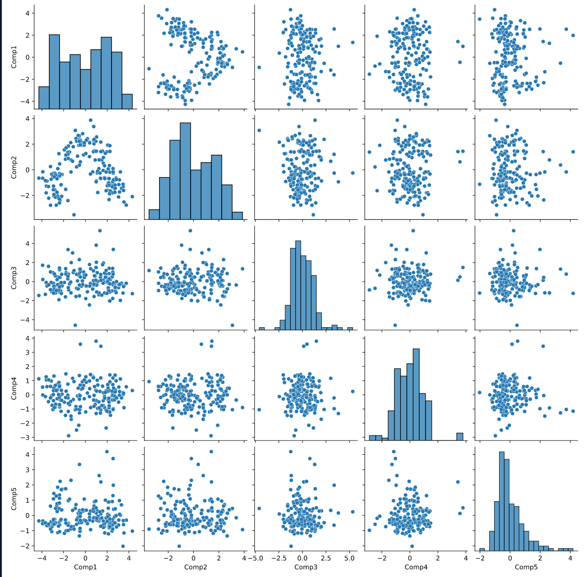

Now, instead looking at a 13 by 13 pair plot, we can zoom in on a 5 by 5 plot that includes all of the original features. In fact, a single plot can be used to visualize relationships between all of the original features at once, not just two at a time. We can see that there is some distinction between groups in clusters 1 and 2, as well as 2 and 4. We also see three fairly clear groups in the plot of component 1 vs. 2. But what does this mean about our original features?

We can look at the weights for each of these components and see which features were most highly weighted in components 1 and 2 (which seem to cluster into three clear groups):

|                      |   Comp1   |    Comp2   |   Comp3   |   Comp4   |   Comp5   |
|:--------------------:|:---------:|:----------:|:---------:|:---------:|:---------:|
| Alcohol              | 0.144329  | -0.483652  | -0.207383 | -0.017856 | -0.265664 |
| Malic_Acid           | -0.245188 | -0.224931  | 0.089013  | 0.536890  | 0.035214  |
| Ash                  | -0.002051 | 0.626224   | 0.626224  | -0.214176 | -0.143025 |
| Ash_Alcanity         | -0.239320 | 0.010591   | 0.612080  | 0.060859  | 0.066103  |
| Magnesium            | 0.141992  | -0.299634  | 0.130757  | -0.351797 | 0.727049  |
| Total_Phenols        | 0.394661  | -0.065040  | 0.146179  | 0.198068  | -0.149318 |
| Flavanoids           | 0.422934  | 0.003360   | 0.150682  | 0.152295  | -0.109026 |
| Nonflavanoid_Phenols | -0.298533 | -0.0287790 | 0.170368  | -0.203301 | -0.500703 |
| Proanthocyanins      | 0.313429  | -0.039302  | 0.149454  | 0.399057  | 0.136860  |
| Color_Intensity      | -0.088617 | -0.529996  | -0.137306 | 0.065926  | -0.076437 |
| Hue                  | 0.296715  | 0.279235   | 0.085222  | -0.427771 | -0.173615 |
| OD280                | 0.376167  | 0.164496   | 0.166005  | 0.184121  | -0.101161 |
| Proline              | 0.286752  | -0.364903  | -0.126746 | -0.232071 | -0.157869 |

We are looking for the highest weighted feature for each component of interest. For component 1, this would be `Flavanoids`, component 2, `Color_Intensity`, and so on. These may be particularly important features to include in our model.

We can also use the transformed data to visually inspect the groups that are produced by other supervised machine learning methods. For example, here is the same pair plot of the transformed data, but the points are colored by the outcome of a k-means analysis with 3 groups:

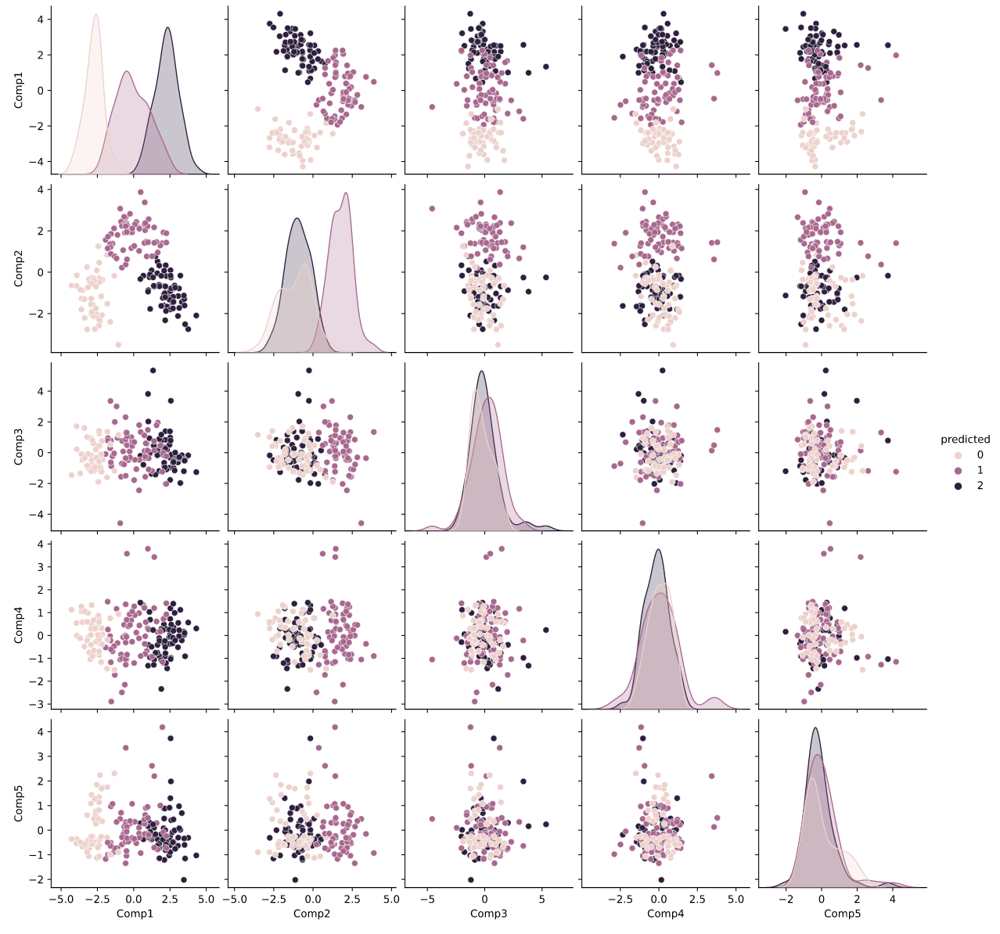

We can see here that the groupings we saw in the PCA-transformed data align with those produced by the k-means model. Specifically, we see that the pair plot of components 1 and 2 separates the k-means clusters particularly well.

We can also look at the same bivariate scatterplots from earlier, with the added k-means results:

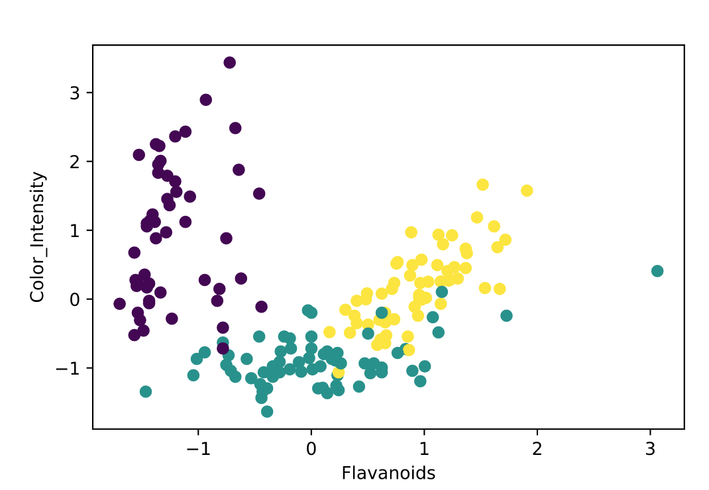
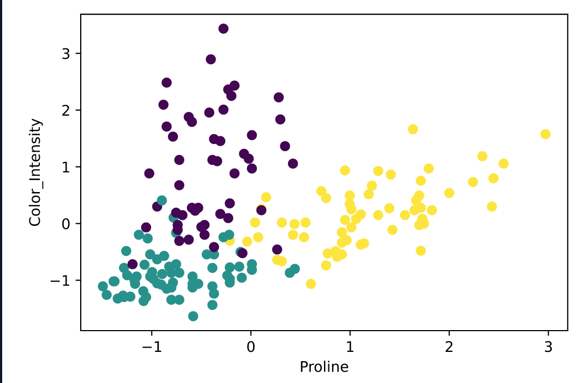
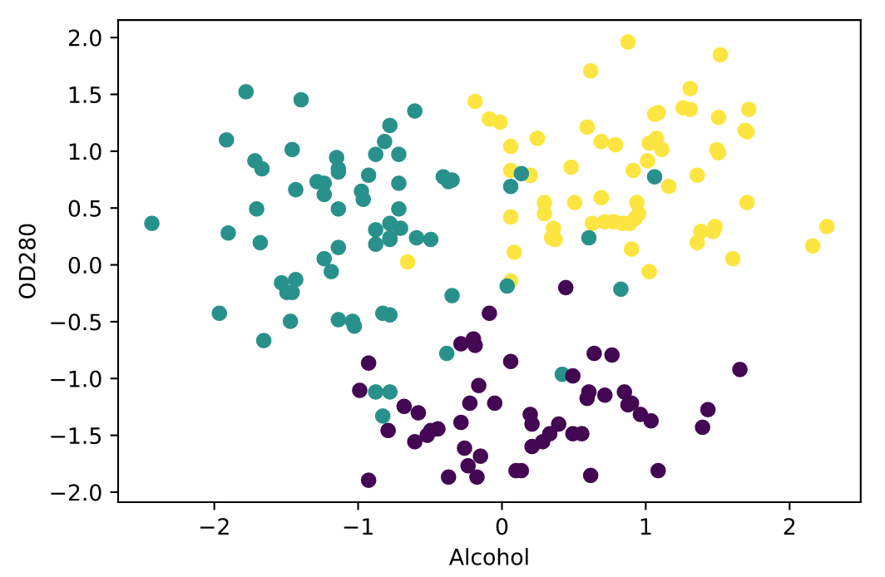

We suspected that these features would be useful in clustering our wines, and now we see that the k-means model is producing groups based on these features. This is also useful for explaining the k-means model to potential stake-holders. For example, we can say that the “purple” group produced by our k-means model is characterized by lower than average amounts of flavanoids and higher than average color intensity.

# Conclusion

EDA before and after fitting unsupervised clustering algorithms is extremely helpful for checking model assumptions, choosing an algorithm, determining the number of groups, and explaining the results to potential stake-holders.