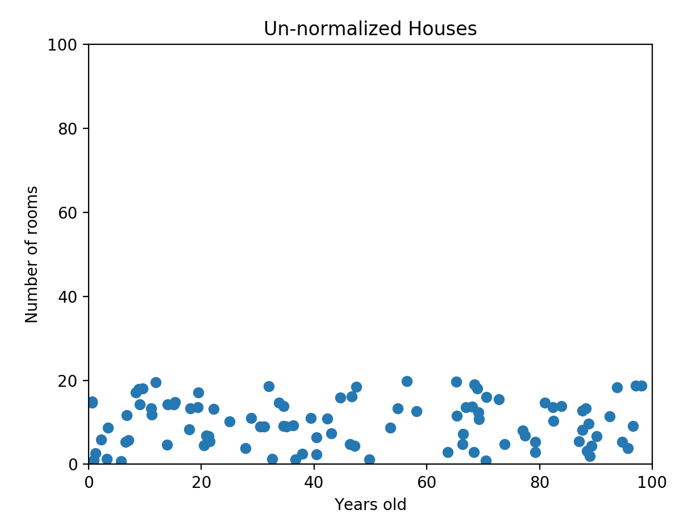
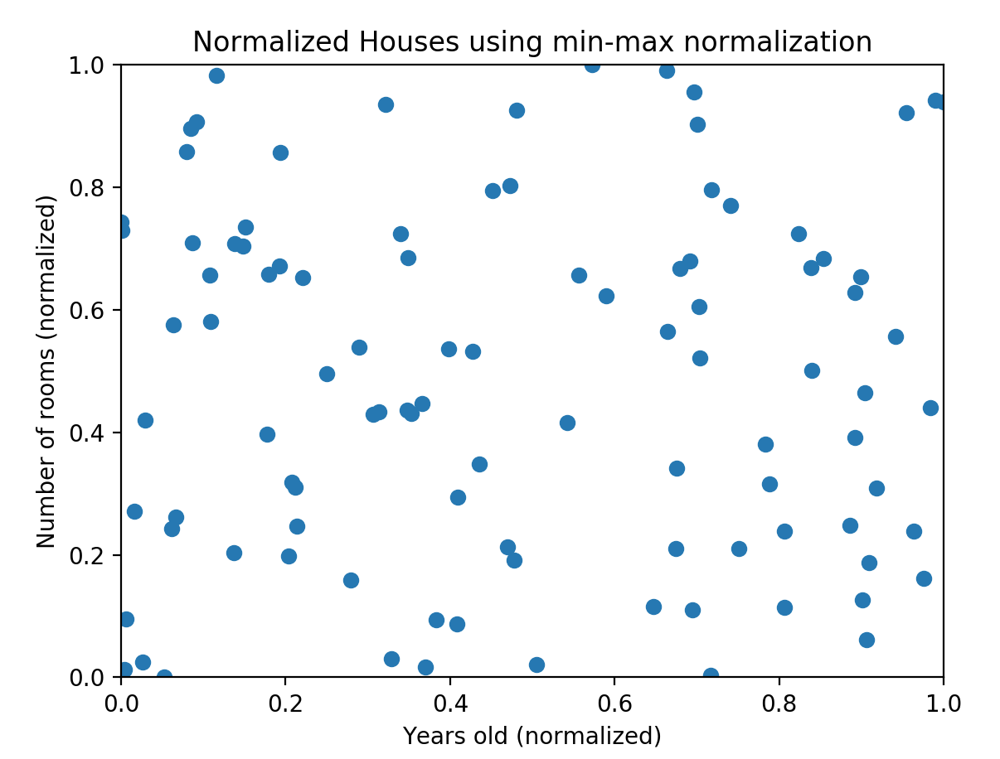
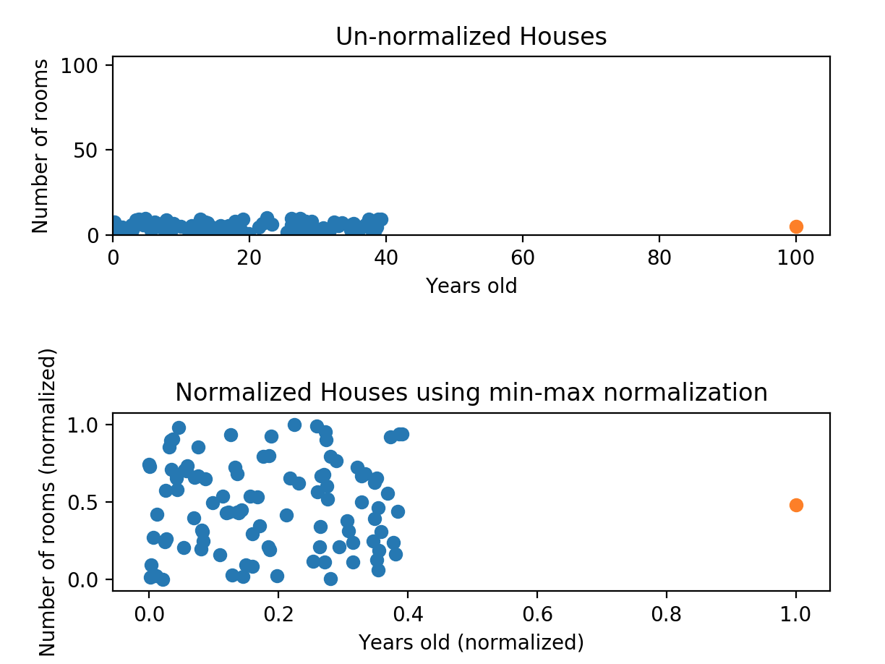
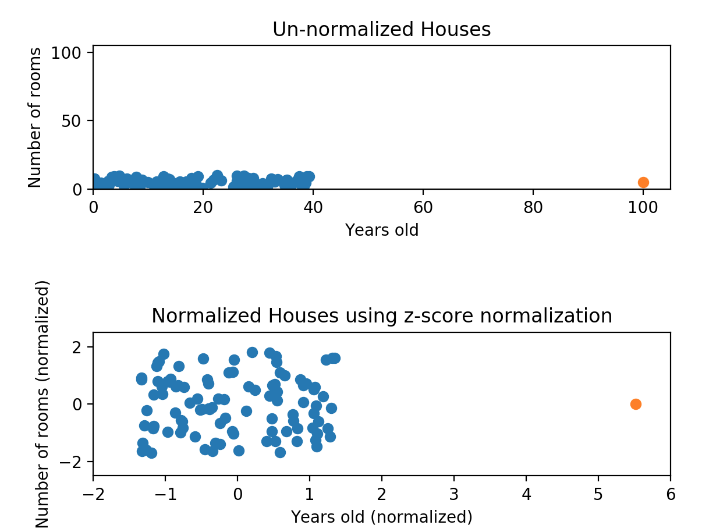

# Normalization

This article describes why normalization is necessary. It also demonstrates the pros and cons of min-max normalization and z-score normalization.

## Why Normalize?
Many machine learning algorithms attempt to find trends in the data by comparing features of data points. However, there is an issue when the features are on drastically different scales.

For example, consider a dataset of houses. Two potential features might be the number of rooms in the house, and the total age of the house in years. A machine learning algorithm could try to predict which house would be best for you. However, when the algorithm compares data points, the feature with the larger scale will completely dominate the other. Take a look at the image below:


When the data looks squished like that, we know we have a problem. The machine learning algorithm should realize that there is a huge difference between a house with 2 rooms and a house with 20 rooms. But right now, because two houses can be 100 years apart, the difference in the number of rooms contributes less to the overall difference.

As a more extreme example, imagine what the graph would look like if the x-axis was the cost of the house. The data would look even more squished; the difference in the number of rooms would be even less relevant because the cost of two houses could have a difference of thousands of dollars.

The goal of normalization is to make every datapoint have the same scale so each feature is equally important. The image below shows the same house data normalized using min-max normalization.



# Min-Max Normalization
Min-max normalization is one of the most common ways to normalize data. For every feature, the minimum value of that feature gets transformed into a 0, the maximum value gets transformed into a 1, and every other value gets transformed into a decimal between 0 and 1.

For example, if the minimum value of a feature was 20, and the maximum value was 40, then 30 would be transformed to about 0.5 since it is halfway between 20 and 40. The formula is as follows:
```
value −min
-----------
max - min
```
Min-max normalization has one fairly significant downside: it does not handle outliers very well. For example, if you have 99 values between 0 and 40, and one value is 100, then the 99 values will all be transformed to a value between 0 and 0.4. That data is just as squished as before! Take a look at the image below to see an example of this.



Normalizing fixed the squishing problem on the y-axis, but the x-axis is still problematic. Now if we were to compare these points, the y-axis would dominate; the y-axis can differ by 1, but the x-axis can only differ by 0.4.

# Z-Score Normalization

Z-score normalization is a strategy of normalizing data that avoids this outlier issue. The formula for Z-score normalization is below:
```
   σ
--------
value−μ​
```
Here, μ is the mean value of the feature and σ is the standard deviation of the feature. If a value is exactly equal to the mean of all the values of the feature, it will be normalized to 0. If it is below the mean, it will be a negative number, and if it is above the mean it will be a positive number. The size of those negative and positive numbers is determined by the standard deviation of the original feature. If the unnormalized data had a large standard deviation, the normalized values will be closer to 0.

Take a look at the graph below. This is the same data as before, but this time we’re using z-score normalization.



While the data still looks squished, notice that the points are now on roughly the same scale for both features — almost all points are between -2 and 2 on both the x-axis and y-axis. The only potential downside is that the features aren’t on the exact same scale.

With min-max normalization, we were guaranteed to reshape both of our features to be between 0 and 1. Using z-score normalization, the x-axis now has a range from about -1.5 to 1.5 while the y-axis has a range from about -2 to 2. This is certainly better than before; the x-axis, which previously had a range of 0 to 40, is no longer dominating the y-axis.

# Review
Normalizing your data is an essential part of machine learning. You might have an amazing dataset with many great features, but if you forget to normalize, one of those features might completely dominate the others. It’s like you’re throwing away almost all of your information! Normalizing solves this problem. In this article, you learned the following techniques to normalize:

* Min-max normalization: Guarantees all features will have the exact same scale but does not handle outliers well.
* Z-score normalization: Handles outliers, but does not produce normalized data with the exact same scale.
