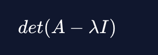
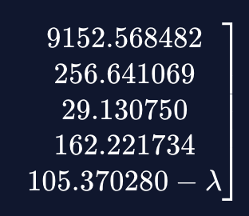
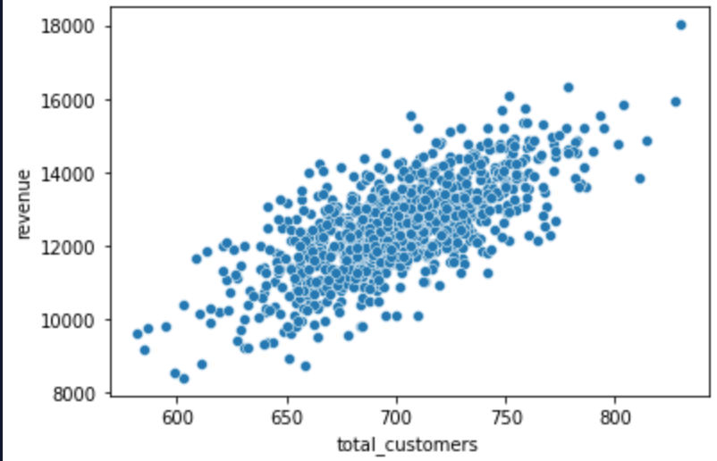
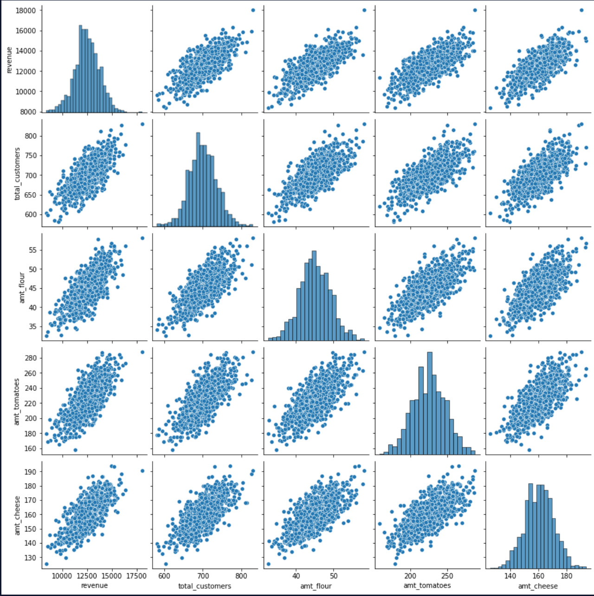

# What is PCA?

Learn how, when, and why to use Principal Component Analysis (PCA) as part of the Machine Learning lifecycle.

# Introduction to PCA
In the world of Machine Learning, any model that we implement will be more valuable when the features are engineered to suit the question we’re trying to answer. With many datasets, we can simply include all available features, which gives us the full picture about our observations. For example, it’s straightforward to see a correlation between height and weight for a patient dataset. Some datasets, however, have very large numbers of features. If our example patient dataset expanded to include 20 different features, how would we visualize and correlate this data? When it comes time to actually process the data and train the model, we often hit computational or complexity limits. How do we leverage correlations within the data to make fewer, better features without losing the information included in the dataset?

Situations like this are a great use case for implementing Principal Component Analysis. PCA is a technique where we can reduce the number of features in a dataset without losing any of the information we have. Sounds pretty great right? This article will cover various aspects of PCA, so let’s dive in.

# Laying the groundwork for PCA
Before we dive into the specifics of PCA, we need to understand the importance of information. In particular, we need to understand how variance plays into the level of information in a dataset. For the purposes of this article, we will be looking at a synthetic dataset about local pizza stores. Let’s see what data we have:
```py
import pandas as pd
import matplotlib.pyplot as plt

df = pd.read_csv('pizza.csv')

print(df.columns)
```

Output:

```py
Index(['revenue', 'total_customers', 'amt_flour', 'amt_tomatoes',
       'amt_cheese'],
      dtype='object')
```

Each row of data pertains to an individual store, and gives information about how the store is doing overall with inventory and sales. Suppose we look at just `revenue` and `total_customers`, and we see the following information:

| revenue | total_customers |
|:-------:|:---------------:|
| 12345   | 500             |
| 13425   | 500             |
| 10872   | 500             |
| 9561    | 500             |

In this scenario, the value for `total_customers` has a value of `500` for every row. While every row has a value, and therefore has data, this column does not provide a lot of information, due to the lack of variance in the values. While we could include this feature in our downstream analytics, it doesn’t provide any additional value, because each row would have the same data.

Now let’s look at what the real data shows us for these two columns:
```py
df[['revenue','total_customers']].head()
```
Output:
```
    revenue total_customers
0   9931.860710 615.336682
1   12397.798907    725.440590
2   11983.079340    630.987797
3   13910.984353    746.264763
4   13083.859701    689.060436
```

As we can see, the real dataset has far more variance in these two columns. Since each feature has significant variance, these features provide valuable information about our observations, and should therefore be included in our analysis.

Variance alone is one indicator of the level of information in a dataset, but is not the only factor. To expand on the idea of variance within a dataset, we will look at the Coefficient of Variance, or CV for short. The premise here is that variance must be taken into context with the central tendencies of that dataset. For example, if a dataset has a variance of 5, that will mean very different things if the mean is 2 vs. a dataset with a mean of 100.

Now, let’s actually calculate the Coefficient of Variance for each of our columns.
```py
import numpy as np

#define function to calculate cv
cv = lambda x: np.std(x, ddof=1) / np.mean(x) * 100

print(df.apply(cv))
```

Output:
```py
revenue            10.001034
total_customers     5.138628
amt_flour           9.128946
amt_tomatoes        9.926973
amt_cheese          6.401035
dtype: float64
```

All of the features in this dataset have enough variance where they will be useful in analysis. Since variance is an important factor to PCA, these features will ultimately be ordered by the level of information (i.e. variance) they have. For this dataset, that means, in order of importance, PCA will look at `revenue`, `amt_tomatoes`, `amt_flour`, `amt_cheese`, and then `total_customers`. While the results of PCA won’t resemble our original features, they will be a mathematical representation of the information contained in the original features, which has value for analytical purposes.

## Coding question

The kind of information we have can vary from dataset to dataset, and thus can the Coefficient of Variance. Use what you just learned on a new set of synthetic pizza store data, pizza_new.csv. Calculate the Coefficients of Variance for each feature in the dataset. Then, create a ranked order Python list for the features in the dataset in terms of information for PCA, from most important to least important.


```py
import numpy as np
import pandas as pd

# Load in new pizza dataset
df = pd.read_csv('pizza_new.csv')
df.head()

# Calculate coefficient of variance for every feature
cv = lambda x: np.std(df, ddof=1) / np.mean(df) * 100

# Rank order of importance from highest to lowest (in a list)
importance_rank = df.apply(cv)
#.sort(reverse=True)
print(importance_rank)
```

# The Math Behind PCA

At this point, we need to address how we can actually take information from multiple features and distill it down into a smaller number of features. Let’s dive deeper into each of the steps that lead to PCA.
Data Matrix

First, we need to isolate a Data Matrix, another name for a dataset. This data matrix holds all of the features and information that we are interested in. Many datasets will have columns that hold information (i.e. features), and other columns that we want to predict (i.e. labels). Using our previous pizza dataset, we have 5 features in our data matrix.

|    revenue   | total_customers | amt_flour | amt_tomatoes | amt_cheese |
|:------------:|:---------------:|:---------:|:------------:|:----------:|
| 9931.860710  | 615.336682      | 37.662830 | 174.102712   | 139.402208 |
| 12397.798907 | 725.440590      | 44.424509 | 239.119556   | 168.425842 |
| 11983.079340 | 630.987797      | 40.259276 | 224.084121   | 146.612426 |
| 13910.984353 | 746.264763      | 43.633485 | 227.096619   | 170.726464 |
| 13083.859701 | 689.060436      | 48.964844 | 221.383478   | 154.786070 |

Covariance Matrix

From here, the next step of PCA is to calculate a covariance matrix. Essentially, a covariance matrix is calculating how much a feature changes with changes in every other feature, i.e., we’re looking at the relative variance between any two features. Mathematically, the formula for covariance between two features X and Y is:


We will do this equation for the relationship between each of our features, ultimately resulting in a covariance matrix that shows relationships for the entire dataset. Simplifying our example dataset, we could think about our pizza dataset having five individual features with the names `a`, `b`, `c`, `d`, and `e`. Our ultimate covariance matrix, thus, would end up looking like this:


Luckily, with the `pandas` package, we can calculate a covariance matrix with the `.cov() `method. For our pizza dataset, this results in the following:
```py
    revenue     total_customers amt_flour   amt_tomatoes    amt_cheese
revenue     1.563517e+06    31853.053820    3713.664277 19980.869509    9152.568482
total_customers 3.185305e+04    1295.096885 105.909335  577.443015  256.641069
amt_flour   3.713664e+03    105.909335  16.894551   66.165738   29.130750
amt_tomatoes    1.998087e+04    577.443015  66.165738   500.715936  162.221734
amt_cheese  9.152568e+03    256.641069  29.130750   162.221734  105.370280
```

One important point to note is that along the primary diagonal (from top-left to bottom-right), we see the same variance values that we calculated for each individual column earlier on.

# Matrix Factorization, Eigenvalues, and Eigenvectors
We now have a matrix of variance values for our features. The next step in PCA revolves around matrix factorization. Without going into too much detail, our goal with matrix factorization is to find a pair of smaller matrices whose product would equal our covariance matrix. Another way of thinking about it: we want to find a smaller matrix that captures the majority of our information.

An important part of this matrix factorization are Eigenvectors. Eigenvectors are vectors (mathematical concepts that have direction and magnitude) that do not change direction when a transformation is applied to them. In the context of data matrices, these eigenvectors give us a direction to “rotate” the dataset in n-dimensional space so we can look at the entire dataset from a simplified perspective. The eigenvalues are related to the relative variation described by each principal component.

For a matrix `A`, the eigenvectors and eigenvalues are the solutions to the following equation:



After some linear algebra, for our covariance matrix, we are looking for the solution to the following matrix, which will be our eigenvectors and eigenvalues.


```
det⎣⎢⎢⎢⎢⎡​1.563517e+06−λ3.185305e+043.713664e+031.998087e+049.152568e+03​31853.0538201295.096885−λ105.909335577.443015256.641069​3713.664277105.90933516.894551−λ66.16573829.130750​19980.869509577.44301566.165738500.715936−λ162.221734​9152.568482256.64106929.130750162.221734105.370280−λ​⎦⎥⎥⎥⎥⎤​
```

 

# Principal Components
All of the underlying math behind PCA results in principal components, but what exactly are they? Principal components are a linear combination of all the input features from the original dataset. By using the eigenvectors we calculated earlier, we can “rotate” our dataset features from an n-dimensional space into a 2-dimensional space, which is easier for us to understand and analyze.

To illustrate this point, let’s return to our pizza dataset. We can observe the correlation between our `revenue` and `total_customers` features.
```py
sns.scatterplot(x='total_customers',
    y='revenue',
    data=df)
```



We can see a positive correlation between these two features, and could use that information to guide any analysis we perform. We can also do correlation plots for every combination of features, like so:

```py
sns.pairplot(df)
```



Each individual combination of features will have its own correlation and variance, both of which provide valuable information about that relationship. When comparing two features at a time, these relationships are more understandable. If we wanted to, however, look at all of the feature relationships and information at once, it would be very difficult to decipher, as we cannot visualize data in a 5-dimensional space.

By using PCA, however, we can reduce the dimensionality of our dataset into a 2-dimensional dataset, allowing for better visualization. Let’s see the result.

```py
from sklearn.decomposition import PCA

pca = PCA(n_components=2)
pca_array = pca.fit_transform(df)
```

Output:

```py
array([[-2572.64663126,   -37.43225524],
       [ -104.21066949,    31.54952593],
       [ -521.0563251 ,   -54.19045713],
       ...,
       [ 1429.58053669,    -5.98229122],
       [-3550.23561932,    23.8935932 ],
       [ -481.85213117,   -34.14891261]])
```

As we can see, by running PCA on our original dataset, we were able to take our 5 features and reduce the dimensions down to 2 principal components. With 2 dimensions, we can now plot the data on a single scatterplot:

```py
sns.scatterplot(pca_array[:,0], pca_array[:,1])
```


While it can be difficult to interpret what this new data matrix is showing us, it does hold valuable information that can be used in a variety of contexts. The axes of this chart are the two most impactful principal components as part of our analysis, and were the two that we decided to keep.

# The How, Where, and Why of PCA

PCA serves an important role in many different parts of data science and analytics in general, as this process allows us to maximize the amount of information we can extract from data while reducing computational time down the line. We just saw a common use case for PCA with our pizza dataset. We took a higher dimensional dataset (5 dimensions in our case), and reduced it down to 2 dimensions. This two-dimensional dataset can now be an input to a variety of Machine Learning models. For example, we could use this new dataset as part of a forecasting model, or perform linear regression. These techniques would have been much more difficult prior to performing PCA.

PCA is also inherently an unsupervised learning algorithm and can be used to identify clusters in data on its own. Very similar to the popular `k-means` algorithms, PCA will look at overall similarities between the different features in a dataset. When we set the number of principal components to keep, we are defining the number of similar “rotations” of our dataset, which will act very much like a cluster of their own. Typically, many practitioners will implement PCA as a precursor to other clustering algorithms to augment the accuracy, but it is an interesting application to do clustering with PCA alone!

Another, very powerful, application of PCA is with image processing. Images hold a vast amount of information in each file, and analyzing this information can have very useful applications. Image classification, for example, uses algorithms to detect the subject of an image, or find a particular object within the image. Overall, it can be very costly to process image data, due to the high dimensionality it has. By applying PCA, however, practitioners can reduce the number of features for the image with minimal information loss and continue their processing.

Below are two images from a Fruit and Vegetable Image dataset. The first image is the original image, and the second is the reconstructed image using the calculated eigenvectors after performing PCA. Note that, in this very quick example, there is minimal information loss, meaning that data could be effectively used for analytics.


# reconstructed_pineapple.png
Summary

In this article, you learned the underlying mathematics behind Principal Component Analysis (PCA) and got a bird’s eye view of how, when, and where to implement PCA. Principal Component Analysis is a powerful tool that provides a mechanism to reduce dimensionality and simplify datasets without losing the valuable information they inherently contain. The following image summarizes the different applications of PCA and we are now ready to delve into these in detail! 


