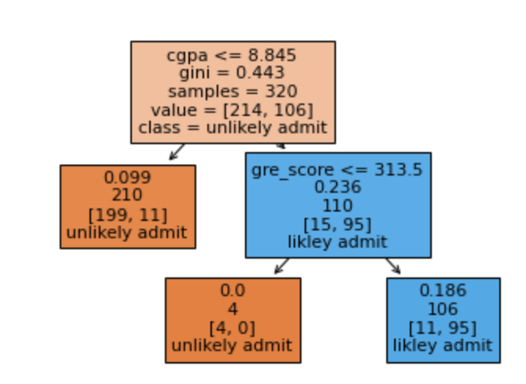

# Decision Trees for Classification and Regression

## Introduction
Decision trees are a common type of machine learning model used for binary classification tasks. The natural structure of a binary tree lends itself well to predicting a “yes” or “no” target. It is traversed sequentially here by evaluating the truth of each logical statement until the final prediction outcome is reached. Some examples of classification tasks that can use decision trees are: predicting whether a student will pass or fail an exam, whether an email is spam or not, if transaction is fraudulent or legitimate, etc

Decision trees can also be used for regression tasks! Predicting the grade of a student on an exam, the number of spam emails per day, the amount of fraudulent transactions on a platform, etc. are all possible using decision trees. The algorithm works pretty much the same way, with modifications only to the splitting criteria and how the final output it computed. In this article, we will explore both a binary classification and regression model using decision trees with the [Indian Graduate Admissions dataset](https://www.kaggle.com/mohansacharya/graduate-admissions). 

# Dataset

The data contains features commonly used in determining admission to masters’ degree programs, such as GRE, GPA, and letters of recommendation. The complete list of features is summarized below:

* GRE Scores ( out of 340 )
* TOEFL Scores ( out of 120 )
* University Rating ( out of 5 )
* Statement of Purpose and Letter of Recommendation Strength ( out of 5 )
* Undergraduate GPA ( out of 10 )
* Research Experience ( either 0 or 1 )
* Chance of Admit ( ranging from 0 to 1 )

We’re going to begin by loading the dataset as a `pandas DataFrame`. Feel free to open up a `jupyter` notebook on the side to implement the code in the article!

```py
import pandas as pd
df = pd.read_csv("Admission_Predict.csv")
df.columns = df.columns.str.strip().str.replace(' ','_').str.lower()
```

# Decision Trees for Classification: A Recap

As a first step, we will create a binary class (1=admission likely , 0=admission unlikely) from the `chance of admit` – greater than 80% we will consider as likely. The remaining data columns will be used as predictors.
```py
X = df.loc[:,'gre_score':'research']
y = df['chance_of_admit']>=.8
```

## Fitting and Predicting

We will use `scikit-learn`‘s tree module to create, train, predict, and visualize a decision tree classifier. The syntax is the same as other models in `scikit-learn`, once an instance of the model class is instantiated with `dt = DecisionTreeClassifier()`, `.fit()` can be used to fit the model on the training set. After fitting, `.predict()` (and `predict_proba()`) and `.score()` can be called to generate predictions and score the model on the test data.

As with other `scikit-learn` models, only numeric data can be used (categorical variables and nulls must be handled prior to model fitting). In this case, our categorical features have already been transformed and no missing values are present in the data set.

```py
x_train, x_test, y_train, y_test = train_test_split(X,y, random_state=0, test_size=0.2)
dt = DecisionTreeClassifier(max_depth=2, ccp_alpha=0.01,criterion='gini')
dt.fit(x_train, y_train)
y_pred = dt.predict(x_test)
print(dt.score(x_test, y_test))
print(accuracy_score(y_test, y_pred))
```
Output:
```
0.925
0.925
```

Two methods are available to visualize the tree within the tree module – the first is using `tree_plot` to graphically represent the decision tree. The second uses `export_text` to list the rules behind the splits in the decision tree. There are many other packages available for more visualization options – such as `graphviz`, but may require additional installations and will not be covered here.
```py
tree.plot_tree(dt, feature_names = x_train.columns,  
               max_depth=3, class_names = ['unlikely admit', 'likely admit'],
               label='root', filled=True)
print(tree.export_text(dt, feature_names = X.columns.tolist()))
```
Output:
```
|--- cgpa <= 8.85
|   |--- class: False
|--- cgpa >  8.85
|   |--- gre_score <= 313.50
|   |   |--- class: False
|   |--- gre_score >  313.50
|   |   |--- class: True
```



# Split Criteria

For a classification task, the default split criteria is Gini impurity – this gives us a measure of how “impure” the groups are. At the root node, the first split is then chosen as the one that maximizes the information gain, i.e. decreases the Gini impurity the most. Our tree has already been built for us, but how was the split `cgpa<=8.845` determined? `cgpa` is a continuous variable, which adds an extra complication, as the split can occur for ANY value of `cgpa`.

To verify, we will use the defined functions `gini` and `info_gain`. By running `gini(y_train)`, we get the same Gini impurity value as printed in the tree at the root node, `0.443`. 

```py
def gini(data):
    """Calculate the Gini Impurity Score
    """
    data = pd.Series(data)
    return 1 - sum(data.value_counts(normalize=True)**2)
   
gi = gini(y_train)
print(f'Gini impurity at root: {round(gi,3)}')
```

Output:
```
Gini impurity at root: 0.443
```

```py
def info_gain(left, right, current_impurity):
    """Information Gain associated with creating a node/split data.
    Input: left, right are data in left branch, right banch, respectively
    current_impurity is the data impurity before splitting into left, right branches
    """
    # weight for gini score of the left branch
    w = float(len(left)) / (len(left) + len(right))
    return current_impurity - w * gini(left) - (1 - w) * gini(right)
```

Next, we are going to verify how the split on cgpa was determined, i.e. where did the `8.845 `value come from. We will use `info_gain` over ALL values of `cgpa` to determine the information gain when split on each value. This is stored in a table and sorted, and voila, the top value for the split is `cgpa<=8.845`! This is also done for every other feature (and for those continuous ones, every value), to find the top split overall.

```py
info_gain_list = []
for i in x_train.cgpa.unique():
    left = y_train[x_train.cgpa<=i]
    right = y_train[x_train.cgpa>i]
    info_gain_list.append([i, info_gain(left, right, gi)])

ig_table = pd.DataFrame(info_gain_list, columns=['split_value', 'info_gain']).sort_values('info_gain',ascending=False)
ig_table.head(10)
```

Output:

```
|  |split_value |   info_gain |
|---|-----|-----|
| 10 | 8.84 | 0.296932 |
| 124 | 8.85 | 0.291464 |
| 139 | 8.88 | 0.290704 |
| 18 | 8.90 | 0.290054 |
| 98 | 8.83 | 0.287810 |
| 110 | 8.87 | 0.286050 |
| 152 | 8.94 | 0.284714 |
| 57 | 8.96 | 0.284210 |
| 96 | 8.80 | 0.283371 |
| 21 | 9.00 | 0.283364 |
```

```py
plt.plot(ig_table['split_value'], ig_table['info_gain'],'o')
plt.plot(ig_table['split_value'].iloc[0], ig_table['info_gain'].iloc[0],'r*')
plt.xlabel('cgpa split value')
plt.ylabel('info gain')
```


After this process is repeated, and there is no further info gain by splitting, the tree is finally built. Last to evaluate, any sample traverses through tree and appropriate splits until it reaches a leaf node, and then assigned the majority class of that leaf (or weighted majority).

# Regression
For the regression problem, we will use the unaltered `chance_of_admit` target, which is a floating point value between 0 and 1.
```py
X = df.loc[:,'gre_score':'research']
y = df['chance_of_admit']
```

## Fitting and Predicting

The syntax is identical as the decision tree classifier, except the target, `y`, must be real-valued and the model used must be `DecisionTreeRegressor()`. As far as the model hyperparameters go, almost all are the same, except for the split criterion. The split criterion now needs be suitable for a regression task – the default for regression is Mean Squared Error (or MSE). Let’s investigate this:
```py
x_train, x_test, y_train, y_test = train_test_split(X,y, random_state=0, test_size=0.2)
dt = DecisionTreeRegressor(max_depth=3, ccp_alpha=0.001)
dt.fit(x_train, y_train)
y_pred = dt.predict(x_test)
print(dt.score(x_test, y_test))
```

Similarly, the tree can be visualized using `tree.plot_tree` – keeping in mind the splitting criteria is `mse` and the `value` is the average `chance_of_admit` of all samples in that leaf.

```py
plt.figure(figsize=(10,10))
tree.plot_tree(dt, feature_names = x_train.columns,  
               max_depth=2, filled=True);
```


## Split Criteria

Unlike the classification problem, there are no longer classes to split the tree by. Instead, at each level, the value is the average of all samples that fit the logical criteria. In terms of evaluating the split, the default method is MSE. For example, the root node, the average target value is 0.727 (verify `y_train.mean()`). Then the MSE (mean-squared error) if we were to use 0.727 as the value for all samples, would be:

`np.mean((y_train - y_train.mean())**2) = 0.02029`

Now to determine the split, for each value of `cpga`, the information gain, or decrease in MSE after the split, is calculated and then values are sorted. Like before, we can modify our functions for the regression version, and see the best split is again `cpga<=8.84`.

The below code walks you through the details – in the regression version, instead of Gini impurity, MSE is used, and the information gain function is modified to `mse_gain`.

```py
def mse(data):
    """Calculate the MSE of a data set
    """
    return np.mean((data - data.mean())**2)
   
def mse_gain(left, right, current_mse):
    """Information Gain (MSE) associated with creating a node/split data based on MSE.
    Input: left, right are data in left branch, right banch, respectively
    current_impurity is the data impurity before splitting into left, right branches
    """
    # weight for gini score of the left branch
    w = float(len(left)) / (len(left) + len(right))
    return current_mse - w * mse(left) - (1 - w) * mse(right)

m = mse(y_train)
print(f'MSE at root: {round(m,3)}')

mse_gain_list = []
for i in x_train.cgpa.unique():
    left = y_train[x_train.cgpa<=i]
    right = y_train[x_train.cgpa>i]
    mse_gain_list.append([i, mse_gain(left, right, m)])

mse_table = pd.DataFrame(mse_gain_list,columns=['split_value', 'info_gain']).sort_values('info_gain',ascending=False)
print(mse_table.head(10))
```

Output:
```
MSE at root: 0.021
     split_value  info_gain
10          8.84   0.011065
96          8.80   0.011037
98          8.83   0.011023
124         8.85   0.010985
125         8.73   0.010939
110         8.87   0.010932
139         8.88   0.010895
1           8.70   0.010894
17          8.76   0.010858
140         8.74   0.010850
```

```py
plt.plot(mse_table['split_value'], mse_table['info_gain'],'o')
plt.plot(mse_table['split_value'].iloc[0], mse_table['info_gain'].iloc[0],'r*')
plt.xlabel('cgpa split value')
plt.ylabel('info gain')
```


Again, the process will continue until there is no increase in information gain by splitting. Now that the tree has been built, evaluation occurs in pretty much the same way. Any sample traverses through the tree until it reaches a leaf node and is then assigned the average value of the samples in leaf. Depending on the depth of the tree, the predicted values can be limited. In this example, only four unique predicted values are possible, which we can verify. This is something to be aware of when using a decision tree regressor, unlike linear/logistic regression, not all output values may be possible.
```py
np.unique(dt.predict(x_train))
```

Output:
```
array([0.        , 0.00588235, 0.28571429, 0.32      , 0.63636364,
       0.96428571])
```


# Summary

We’ve seen how decision trees can be used for both classification and regression tasks.

* The fundamental difference is that for classification, splits are based on Gini impurity error calculations whereas for regression, Mean Squared Error minimization is used.
* Tree traversal based on information gain and evaluation works pretty much the same way for both tasks.
* Decision tree regressors differ from other regressors in that all output values may not be possible and it depends on the depth of the tree.

