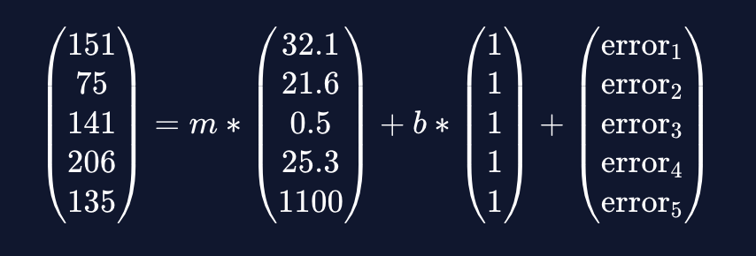

# Solving a Regression Problem: Ordinary Least Squares to Gradient Descent

Learn about how the linear regression problem is solved analytically (using Ordinary Least Squares) and algorithmically (using Gradient Descent) and how these two methods are connected!

Linear regression finds a linear relationship between one or more predictor variables and an outcome variable. This article will explore two different ways of finding linear relationships: Ordinary Least Squares and Gradient Descent.

# Ordinary Least Squares

To understand the method of least squares, let’s take a look at how to set up the linear regression problem with linear equations. We’ll use the [Diabetes dataset](https://scikit-learn.org/stable/datasets/toy_dataset.html#diabetes-dataset) as an example. The outcome variable, Y, is a measure of disease progression. There are 10 predictor variables in this dataset, but to simplify things let’s take a look at just one of them: BP (average blood pressure). Here are the first five rows of data:

```
BP 	    Y
32.1 	151
21.6 	75
0.5 	141
25.3 	206
23 	    135
```

We can fit the data with the following simple linear regression model with slope m and intercept b:

```
Y = m ∗ BP + b + error
```

This equation is actually short-hand for a large number of equations — one for each patient in our dataset. The first five equations (corresponding to the first five rows of the dataset) are:

```
151 = m ∗ 32.1 + b + error
1​75 = m ∗ 21.6 + b + error2
​141 = m ∗ 0.5 + b + error3
​206 = m ∗ 25.3 + b + error4
​135 = m ∗ 23 + b + error5​​
```

When we fit this linear regression model, we are trying to find the values of m and b such that the sum of the squared error terms above (e.g., _error_1^2 + error_2^2 + error_3^2 + error_4^2 + error_5^2 + …._) is minimized.

We can create a column matrix of Y (the outcome variable), a column matrix of BP (the predictor variable), and a column matrix of the errors and rewrite the five equations above as one matrix equation:



Using the rules of matrix addition and multiplication, it is possible to simplify this to the following.


In total we have 4 matrices in this equation:

* A one-column matrix on the left hand side of the equation containing the outcome variable values that we will call Y
* A two-column matrix on the right hand side that contains a column of 1’s and a column of the predictor variable values (BP here) that we will call X.
* A one-column matrix containing the intercept b and the slope m, i.e, the solution matrix that we will denote by the Greek letter beta. The goal of the regression problem is to find this matrix.
* A one-column matrix of the residuals or errors, the error matrix. The regression problem can be solved by minimizing the sum of the squares of the elements of this matrix. The error matrix will be denoted by the Greek letter epsilon.

Using these shorthands, the matrix representation of the regression equation is thus:

```
Y =Xβ + ϵ
```

Ordinary Least Squares gives us an explicit formula for beta. Here’s the formula:
```
β = (XXT) − 1XTYβ = (XXT) − 1XTY
```

A couple of reminders: X^T is the transpose of X. M^{-1} is the inverse of a matrix. We won’t review these terms here, but if you want to know more you can check the Wikipedia articles for the [transpose](https://en.wikipedia.org/wiki/Transpose) and [invertible matrices](https://en.wikipedia.org/wiki/Invertible_matrix).

This looks like a fairly simple formula. In theory, you should be able to plug in X and Y, do the computations, and get beta. But it’s not always so simple.

First of all, it’s possible that the matrix XX^T might not even have an inverse. This will be the case if there happens to be an exact linear relationship between some of the columns of X. If there is such a relationship between the columns of X, we say that X is multicollinear. For example, your data set might contain temperature readings in both Fahrenheit and Celsius. Those columns would be linearly related, and thus XX^T would not have an inverse.

In practice, you also have to watch out for data that is almost multicollinear. For example, a data set might have Fahrenheit and Celsius readings that are rounded to the nearest degree. Due to rounding error, those columns would not be perfectly correlated. In that case it would still be possible to compute the inverse of XX^T, but it would lead to other problems. Dealing with situations like that is beyond the scope of this article, but you should be aware that multicollinearity can be troublesome.

Another drawback of the OLS equation for beta is that it can take a long time to compute. Matrix multiplication and matrix inversion are both computationally intensive operations. Data sets with a large of number of predictor variables and rows can make these computations impractical.

# Gradient Descent
Gradient descent is a numerical technique that can determine regression parameters without resorting to OLS. It’s an iterative process that uses calculus to get closer and closer to the exact coefficients one step at a time. To introduce the concept, we’ll look at a simple example: linear regression with one predictor variable. For each row of data, we have the following equation:
```
yi = mxi + b + ϵiyi ​ =mxi ​ + b + ϵi​
```

The sum of the squared errors is


This is the loss function. It depends on two variables: m and b. [Here‘s](https://content.codecademy.com/programs/data-science-path/line-fitter/line-fitter.html) an interactive plot where you can tune the parameters m and b and see how it affects the loss.

Try changing m and b and observe how those changes affect the loss. You can also try to come up with an algorithm for how to adjust m and b in order to minimize the loss.

As you adjust the sliders and try to minimize the loss, you might notice that there is a sweet spot where changing either m or b too far in either direction will increase the loss. Get too far away from that sweet spot, and small changes in m or b will result in bigger changes to the loss.

f playing with the sliders made you think about rates of change, derivatives, and calculus, then you’re well on your way toward understanding gradient descent. The gradient of a function is a calculus concept that’s very similar to the derivative of a function. We won’t cover the technical definition here, but you can think of it as a vector that points uphill in the steepest direction. The steeper the slope, the larger the gradient. If you step in the direction opposite of the gradient, you will move downhill.

That’s where the descent part of the gradient descent comes in. Imagine you’re standing on some undulating terrain with peaks and valleys. Now take a step in the opposite direction of the gradient. If the gradient is large (in other words, if the slope you’re on is steep), take a big step. If the gradient is small, take a small step. If you repeat this process enough times, you’ll probably end up at the bottom of a valley. By going against the gradient, you’ve minimized your elevation!

Here’s an example of how this works in two dimensions.


Let’s take a closer look at how gradient descent works in the case of linear regression with one predictor variable. The process always starts by making starting guesses for m and b. The initial guesses aren’t important. You could make random guesses, or just start with m=0 and b=0. The initial guesses will be adjusted by using gradient formulas.

Here’s the gradient formula for b. This formula can be obtained by differentiating the average of the squared error terms with respect to b.


In this formula,

* N is the total number of observations in the data set,
* x_i and y_i are the observations,
* m is the current guess for the slope of the linear regression equation, and
* b is the current guess for the intercept of the linear regression equation.

Here’s the gradient formula for m. Again, this can be obtained by differentiating the average of the squared error terms with respect to m.


The next step of gradient descent is to adjust the current guesses for m and b by subtracting a number proportional the gradient.

Our new guess for b is


Our new guess for m is


For now, eta is just a constant. We’ll explain it in the next section. Once we get new guesses for m and b, we recompute the gradient and continue the process.


# Learning Rate and Convergence

How big should your steps be when doing gradient descent? Imagine you’re trying to get to the bottom of a valley, one step at a time. If you step one inch at time, it could take a very long time to get to the bottom. You might want to take bigger steps. On the other extreme, imagine you could cover a whole mile in a single step. You’d cover a lot of ground, but you might step over the bottom of the valley and end up on a mountain!

The size of the steps that you take during gradient descent depend on the gradient (remember that we take big steps when the gradient is steep, and small steps when the gradient is small). In order to further tune the size of the steps, machine learning algorithms multiply the gradient by a factor called the learning rate. If this factor is big, gradient descent will take bigger steps and hopefully reach the bottom of the valley faster. In other words, it “learns” the regression parameters faster. But if the learning rate is too big, gradient descent can overshoot the bottom of the valley and fail to converge.

How do you know when to stop doing gradient descent? Imagine trying to find the bottom of a valley if you were blindfolded. How would you know when you reached the lowest point?

If you’re walking downhill (or doing gradient descent on a loss function), sooner or later you’ll reach a point where everything flattens out and moving against the gradient will only reduce your elevation by a negligible amount. When that happens, we say that gradient descent converges. You might have noticed this when you were adjusting m and b on the interactive graph: when m and b are both near their sweet spot, small adjustments to m and b didn’t affect the loss much.

To summarize what we’ve learned so far, here are the steps of gradient descent. We’ll denote the learning rate by eta.

* Set initial guesses for m and b
* Replace m with m + eta * (-gradient) and replace b with b + eta * (-gradient)
* Repeat step 2 until convergence

If the algorithm fails to converge because the loss increases after some steps, the learning rate is probably too large. If the algorithm runs for a long time without converging, then the learning rate is probably too small.

# Implementation in sci-kit learn

Version 1.0.3 of the scikit-learn library has two different linear regression models: one that uses OLS and another that uses a variation of gradient descent.

The `LinearRegression` model uses OLS. For most applications this is a good approach. Even if a data set has hundreds of predictor variables or thousands of observations, your computer will have no problem computing the parameters using OLS. One advantage of OLS is that it is guaranteed to find the exact optimal parameters for linear regression. Another advantage is that you don’t have to worry about what the learning rate is or whether the gradient descent algorithm will converge.

Here’s some code that uses `LinearRegression`. 

```py
from sklearn.datasets import load_diabetes
from sklearn.linear_model import LinearRegression

# Import the data set
X, y = load_diabetes(return_X_y=True)

# Create the OLS linear regression model
ols = LinearRegression()

# Fit the model to the data
ols.fit(X, y)

# Print the coefficients of the model
print(ols.coef_)

# Print R^2
print(ols.score(X, y))
```

```
[ -10.01219782 -239.81908937  519.83978679  324.39042769 -792.18416163
  476.74583782  101.04457032  177.06417623  751.27932109   67.62538639]
0.5177494254132934
```
Scikit-learn’s `SGDRegressor` model uses a variant of gradient descent called stochastic gradient descent (or SGD for short). SGD is very similar to gradient descent, but instead of using the actual gradient it uses an approximation of the gradient that is more efficient to compute. This model is also sophisticated enough to adjust the learning rate as the SGD algorithm iterates, so in many cases you won’t have to worry about setting the learning rate.

`SGDRegressor` also uses a technique called regularization that encourages the model to find smaller parameters. Regularization is beyond the scope of this article, but it’s important to note that the use of regularization can sometimes result in finding different coefficients than OLS would have.

If your data set is simply too large for your computer to handle OLS, you can use `SGDRegressor`. It will not find the exact optimal parameters, but it will get close enough for all practical purposes and it will do so without using too much computing power. Here’s an example.

```py
from sklearn.datasets import load_diabetes
from sklearn.linear_model import SGDRegressor

# Import the data set
X, y = load_diabetes(return_X_y=True)

# Create the SGD linear regression model
# max_iter is the maximum number of iterations of SGD to try before halting
sgd = SGDRegressor(max_iter = 10000)

# Fit the model to the data
sgd.fit(X, y)

# Print the coefficients of the model
print(sgd.coef_)

# Print R^2
print(sgd.score(X, y))
```

```
[  12.19842555 -177.93853188  463.50601685  290.64175509  -33.34621692
  -94.62205923 -202.87056914  129.75873577  386.77536299  123.17079841]
0.5078357600233131
```

# Gradient Descent in Other Machine Learning Algorithms

Gradient descent can be used for much more than just linear regression. In fact, it can be used to train any machine learning algorithm as long as the ML algorithm has a loss function that is a differentiable function of the ML algorithm’s parameters. In more intuitive terms, gradient descent can be used whenever the loss function looks like smooth terrain with hills and valleys (even if those hills and valleys live in a space with more than 3 dimensions).

Gradient descent (or variations of it) can be used to find parameters in logistic regression models, support vector machines, neural networks, and other ML models. Gradient descent’s flexibility makes it an essential part of machine learning.
