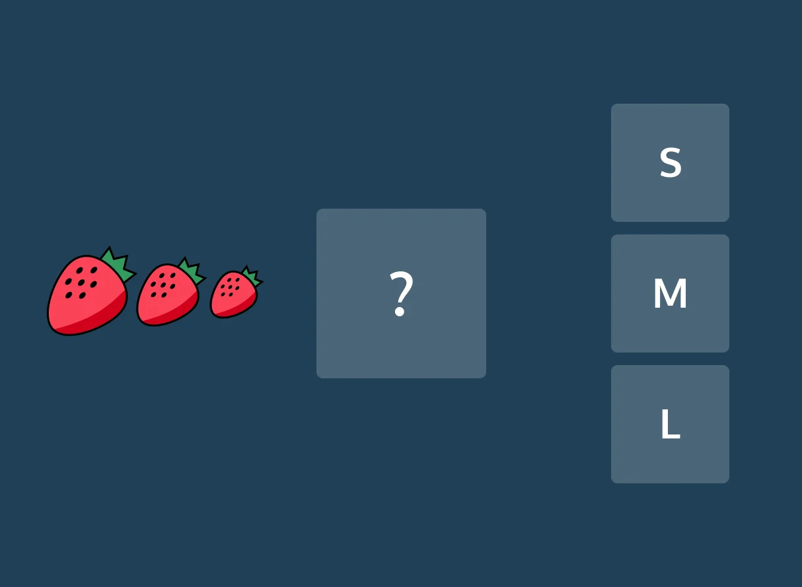
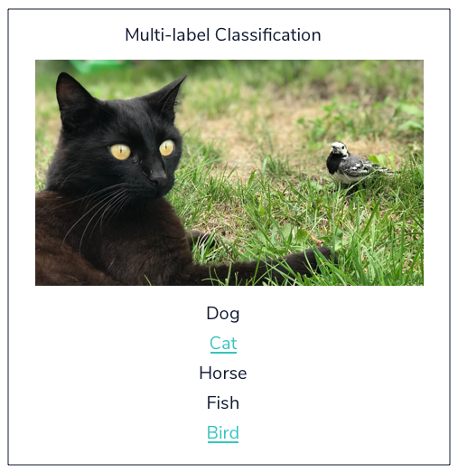

# Regression vs. Classification
Machine Learning is a set of many different techniques that are each suited to answering different types of questions.

One way of categorizing machine learning algorithms is by using the kind output they produce. In terms of output, two main types of machine learning models exist: those for regression and those for classification.

# Regression
Regression is used to predict outputs that are continuous. The outputs are quantities that can be flexibly determined based on the inputs of the model rather than being confined to a set of possible labels.

For example:
* Predict the height of a potted plant from the amount of rainfall
* Predict salary based on someone’s age and availability of high-speed internet
* Predict a car’s MPG (miles per gallon) based on size and model year

Linear regression is the most popular regression algorithm. It is often underrated because of its relative simplicity. In a business setting, it could be used to predict the likelihood that a customer will churn or the revenue a customer will generate. More complex models may fit this data better, at the cost of losing simplicity.

# Classification
Classification is used to predict a `discrete label`. The outputs fall under a finite set of possible outcomes. Many situations have only two possible outcomes. This is called binary classification (True/False, 0 or 1, Hotdog / not Hotdog).

For example:

* Predict whether an email is spam or not
* Predict whether it will rain or not
* Predict whether a user is a power user or a casual user

There are also two other common types of classification: `multi-class` classification and `multi-label` classification.

Multi-class classification has the same idea behind binary classification, except instead of two possible outcomes, there are three or more.

For example:
* Predict whether a photo contains a pear, apple, or peach
* Predict what letter of the alphabet a handwritten character is
* Predict whether a piece of fruit is small, medium, or large

An important note about binary and multi-class classification is that in both, each outcome has one specific label. However, in multi-label classification, there are multiple possible labels for each outcome. This is useful for customer segmentation, image categorization, and sentiment analysis for understanding text. To perform these classifications, we use models like Naive Bayes, K-Nearest Neighbors, SVMs, as well as various deep learning models.

An example of multi-label classification is shown below. Here, a cat and a bird are both identified in a photo showing a classification model with more than one label as a result. 

Choosing a model is a critical step in the [Machine Learning process](https://www.codecademy.com/content-items/895a38ce414fbf1c4dfd463f4fc008fc). It is important that the model fits the question at hand. When you choose the right model, you are already one step closer to getting meaningful and interesting results.