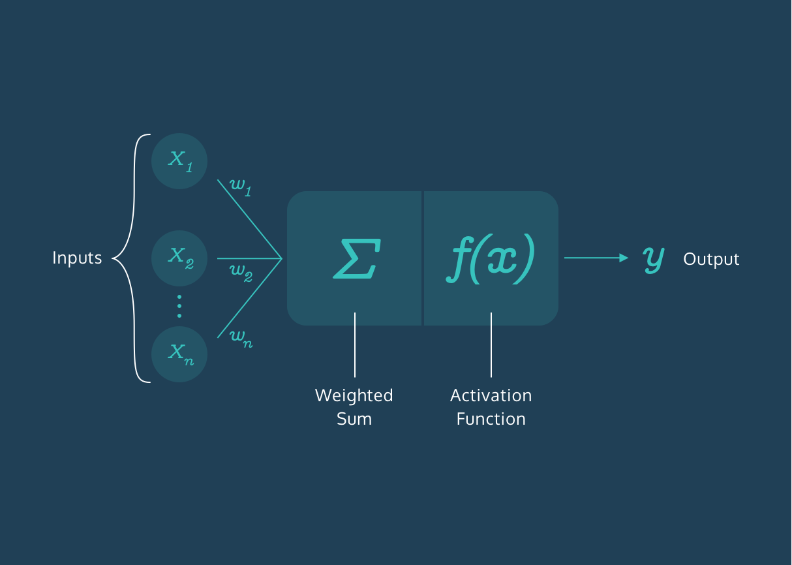
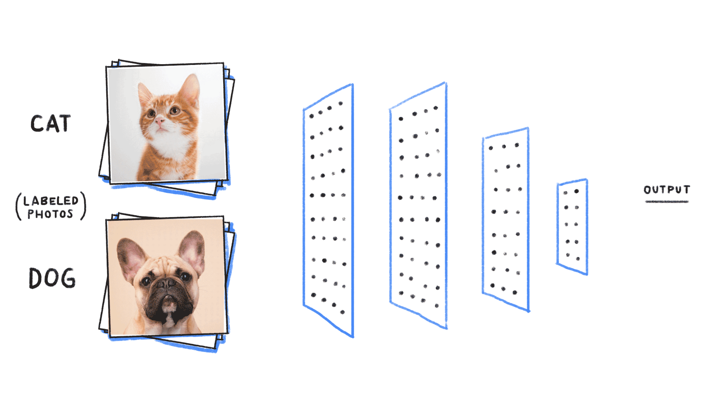

# What are Neural Networks?

An artificial neural network is an interconnected group of nodes, an attempt to mimic to the vast network of neurons in a brain.

### Understanding Neural Networks

As you are reading this article, the very same brain that sometimes forgets why you walked into a room is magically translating these pixels into letters, words, and sentences — a feat that puts the world’s fastest supercomputers to shame. Within the brain, thousands of neurons are firing at incredible speed and accuracy to help us recognize text, images, and the world at large.

A neural network is a programming model inspired by the human brain. Let’s explore how it came into existence.

The Birth of an Artificial Neuron

Computers have been designed to excel at number-crunching tasks, something that most humans find terrifying. On the other hand, humans are naturally wired to effortlessly recognize objects and patterns, something that computers find difficult.

This juxtaposition brought up two important questions in the 1950s:

* “How can computers be better at solving problems that humans find effortless?”
* “How can computers solve such problems in the way a human brain does?”

In 1957, [Frank Rosenblatt](https://en.wikipedia.org/wiki/Frank_Rosenblatt) explored the second question and invented the Perceptron algorithm that allowed an artificial neuron to simulate a biological neuron! The artificial neuron could take in an input, process it based on some rules, and fire a result. But computers had been doing this for years — what was so remarkable? 

There was a final step in the Perceptron algorithm that would give rise to the incredibly mysterious world of Neural Networks — the artificial neuron could train itself based on its own results, and fire better results in the future. In other words, it could learn by trial and error, just like a biological neuron.

## More Neurons

The Perceptron Algorithm used multiple artificial neurons, or perceptrons, for image recognition tasks and opened up a whole new way to solve computational problems. However, as it turns out, this wasn’t enough to solve a wide range of problems, and interest in the Perceptron Algorithm along with Neural Networks waned for many years.

But many years later, the neurons fired back.

It was found out that creating multiple layers of neurons — with one layer feeding its output to the next layer as input — could process a wide range of inputs, make complex decisions, and still produce meaningful results. With some tweaks, the algorithm became known as the __Multilayer Perceptron__, which led to the rise of Feedforward Neural Networks.

### 60 Years Later…
With Feedforward Networks, the results improved. But it was only recently, with the development of high-speed processors, that neural networks finally got the necessary computing power to seamlessly integrate into daily human life.

Today, the applications of neural networks have become widespread — from simple tasks like speech recognition to more complicated tasks like self-driving vehicles.

In 2012, [Alex Krizhevsky](https://qz.com/1307091/the-inside-story-of-how-ai-got-good-enough-to-dominate-silicon-valley/) and his team at University of Toronto entered the ImageNet competition (the annual Olympics of computer vision) and trained a deep convolutional neural network [[pdf]](https://papers.nips.cc/paper/4824-imagenet-classification-with-deep-convolutional-neural-networks.pdf). No one truly understood how it made the decisions it did, but it worked better than any other traditional classifier, by a huge 10.8% margin.

# Summary
The neurons have come a long way. They have braved the AI winter and remained patient amidst the lack of computing power in the 20th century. They have now taken the world by storm and deservedly so.

Neural networks are ridiculously good at generating results but also mysteriously complex; the apparent complexity of the decision-making process makes it difficult to say exactly how neural networks arrive at their superhuman level of accuracy.

Let’s dive into the world of Neural Networks and relish in all its mystery!